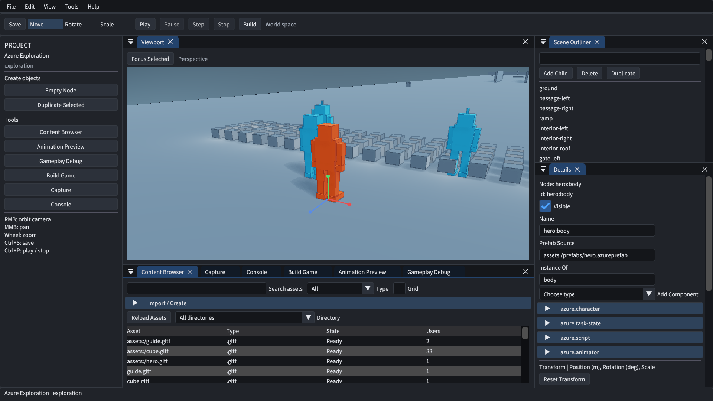
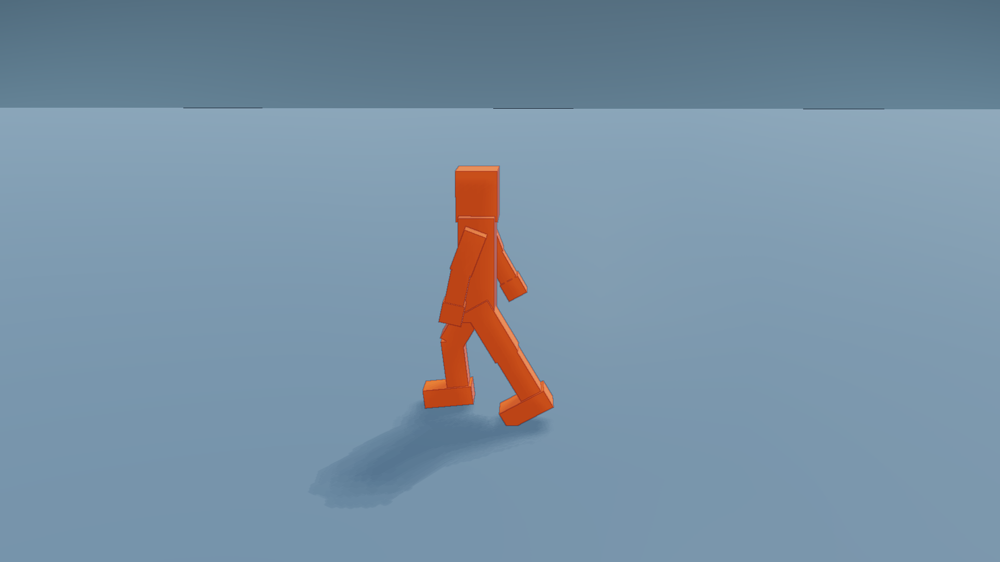
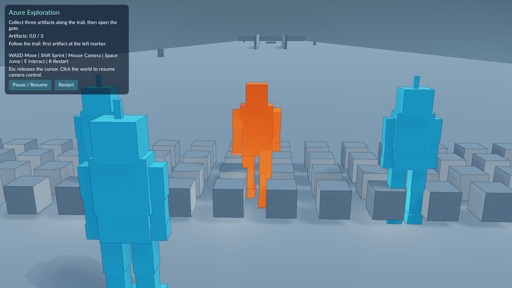

# AzureRender 工程

AzureRender 使用 C++17 与原生 Vulkan 实现渲染核心。引擎提供 Windows 编辑器、独立 Player、资产管线和第三人称玩法。公开探索项目贯通制作、运行与游戏发布。



公开场景由 Release 构建捕获。设备为 RTX 4060 Laptop，分辨率为 1920×1080。编辑器与探索场景采用 100 实体负载。


截图展示公开探索项目。菜单、停靠面板和制作流程见[关卡制作教程](docs/tutorials/editor-first-game.md)。

## 使用入口

| 目标 | 文档 |
| --- | --- |
| 构建和运行 | [构建与使用](docs/getting-started.md) |
| 运行公开游戏 | [第三人称探索关卡](docs/runtime/exploration-gameplay.md) |
| 制作关卡 | [从空关卡制作并发布游戏](docs/tutorials/editor-first-game.md) |
| 发布游戏 | [Windows 游戏发布](docs/runtime/game-publishing.md) |

## 构建编辑器

Windows 工具链为 MSVC、CMake、Ninja、Vulkan SDK 和 vcpkg。本机验收使用 MSVC 14.44 与 Vulkan SDK 1.4.350。

```powershell
$env:VULKAN_SDK = "C:/VulkanSDK/1.4.350.0"
$env:VCPKG_ROOT = "C:/path/to/vcpkg"
./tools/msvc_env.bat cmake --preset msvc-release
./tools/msvc_env.bat cmake --build --preset msvc-release
./build/ninja-msvc-release/AzureRender.exe --editor-project assets_public/exploration/project.azureproject
```

将 vcpkg 路径替换为本机目录。公开示例制作流程使用可写工作副本。安装与发布以完整目录为单位，操作见 [游戏发布](docs/runtime/game-publishing.md)。

## 引擎能力

| 范围 | 内容 |
| --- | --- |
| Render Core | Render Graph、GPU 场景、蒙皮、光照、阴影、透明、描边、诊断与捕获 |
| Runtime | ECS、反射、版本化关卡、Prefab、Jolt、Lua、动画、声音与 RmlUi |
| Editor | 层级、属性、导入、撤销、预览、玩法调试和构建 |
| Player | 项目挂载、输入、角色与相机、任务、切关、重开和退出 |
| 场景扩展 | Character、Blackhole、Sample 与进程内 Renderer SDK |

架构入口为 [引擎基础](docs/runtime/engine-foundation.md)和[渲染器架构](docs/architecture.md)。场景与接口职责通过源码、Schema 和测试定义。

## 验证

```powershell
./tools/msvc_env.bat cmake --preset msvc-debug
./tools/msvc_env.bat cmake --build --preset msvc-debug
ctest --test-dir build/ninja-msvc-debug --output-on-failure
cmake -DBUILD_DIR=build/ninja-msvc-release -DCONFIG=Release -P tools/run_release_gate.cmake
python tools/audit_repository.py --source ../.. --output build/repository-audit.json
```

GPU 验收串行执行。发布门禁覆盖真实游戏包、移动安装树、隔离运行和许可清单。视觉与性能结果见[可玩关卡性能](docs/runtime/playable-performance.md)和 [P2 验收](docs/acceptance/p2/2026-10-05.md)。

| 平台与设备 | 范围 |
| --- | --- |
| Windows x64、RTX 4060 Laptop | 1080p 完整预算、制作、任务与长跑 |
| Windows x64、Intel 核显 | 540p 完整任务、重开与释放 |
| Ubuntu 24.04 CI | 公共构建、软件渲染与文档回归 |

## 公开游戏画面



侧面视角展示公开机器人的行走姿态。输入事件、角色场景和捕获帧进入展示清单。



探索场景展示主角、同伴、关卡与任务界面。图片来源见[展示清单](portfolio/portfolio_manifest.json)。

## 工程结构

`src/` 保存模块实现，`shaders/` 保存 GLSL。`tests/` 保存契约测试，`tools/` 保存构建与验收工具。`docs/` 保存活动说明和阶段证据。`portfolio/` 保存精选公共图像及 manifest。

## 当前开发

F1 至 P1、F3 和 R6 已完成。G7 角色方向与冲刺已验收。U2 工作区与教程、P2 展示与独立交付均已验收。

[总计划](docs/plans/azure-engine-plan.md)管理状态。[本轮实施步骤](docs/plans/2026-10-05-quality-round.md)定义任务与门禁。[CHANGELOG.md](CHANGELOG.md)记录阶段交付。

## 资产与许可

`assets_public/` 包含公共示例、测试资产和许可。`assets_private/` 保存本机授权素材。公开包与截图使用许可明确资源。依赖许可见 [THIRD_PARTY_NOTICES.md](THIRD_PARTY_NOTICES.md)。
