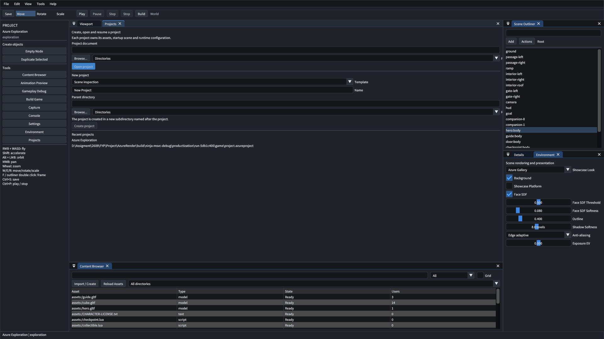

# U8 项目工作区验收

> 状态：Complete
> 日期：2026-10-10
> 环境：Windows，MSVC 14.44，Debug

项目入口提供场景检视和可玩游戏模板。
模板任务可查询进度，并支持取消。
校验通过后，产物在宿主线程提交。
最近项目有缺失诊断和文档定位入口。

项目切换验证保存、放弃及取消语义。
失败的目标校验保留活动文档。
切换重建选择、操纵器和编辑历史。
用户偏好与可用模型服务保留会话归属。

制作和调试布局支持保存与恢复。
独立扩展面板使用现有只读面板契约。
对象、环境、项目与用户设置各有入口。
四类设置按职责分区展示。

## 检查结果

| 检查 | 实际结果 | 证据 |
| --- | --- | --- |
| Debug 全目标重建 | 通过 | [构建记录](evidence/build.log) |
| 全部非 GPU 测试 | 127 项通过 | [CPU 记录](evidence/cpu.log) |
| 工作区与既有制作流程 | 五项 GPU 回归通过 | [GPU 记录](evidence/gpu.log) |
| 标准面板与布局复测 | 通过 | [工作区最终回放](evidence/workspace-final.log) |
| 项目入口与切换复测 | 通过 | [最终回放](evidence/project-ui-final.log) |
| 双项目布局与 DPI | 十二组通过 | [界面摘要](evidence/ui-summary.json) |
| 文档严格构建 | 通过 | 本机 `build/docs-productization` |
| 二进制来源 | SHA256 已记录 | [验收清单](evidence/manifest.json) |

尺寸覆盖 1280×720、1920×1080、2560×1440。
DPI 覆盖 100%、150% 和 200% 的既定组合。
两个项目为探索项目和场景检视项目。
回放通过生产 Dear ImGui 输入路径执行。

合同测试覆盖重名、非法模板和创建取消。
还覆盖缺失项目、未保存切换与历史隔离。
保存后的源文档通过重新打开核验。
过期或损坏布局回归采用既有测试。

## 验证范围

本阶段执行自动界面回放与实际渲染。
实体键鼠人工复核尚未执行。
完整 Release、双设备和发布验收归 P5。
探索与平台游戏的玩法验收归 G15 和 G16。

接口与使用说明见[项目工作区](../../runtime/project-workspace.md)。
后续阶段见[正式实施计划](../../plans/2026-10-09-editor-productization.md)。
