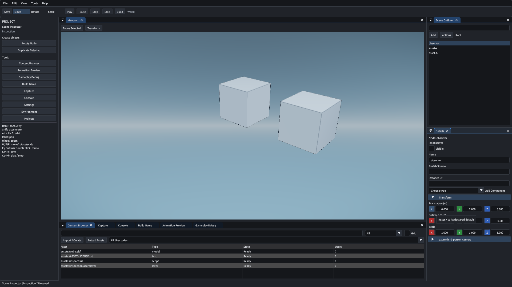

# U9 属性制作验收

> 状态：Complete
> 日期：2026-10-10
> 环境：Windows，MSVC 14.44，Debug

公共属性控件消费注册元数据与默认值。
位置、旋转和缩放提供三轴独立重置。
多选显示共同组件与逐轴混合状态。
扩展组件共享字段校验和批量策略。

整批属性修改通过编辑事务发布。
撤销、重做和连续修改保持统一语义。
引用吸管捕获版本与所属对象。
候选类型错误保留可用会话。

搜索、拖放、清空与揭示使用公共操作。
相机目标按有效节点规则校验。
失焦、Esc 和文档切换结束吸管。
大纲在对象遍历完成后发布引用写入。

## 检查结果

| 检查 | 当前结果 |
| --- | --- |
| Debug 全目标构建 | 通过，见[构建记录](evidence/build.log) |
| 非 GPU 全套 | 129 项通过，见[CPU 记录](evidence/cpu.log) |
| 多选与引用契约 | 通过，包含注册扩展 |
| UI 轴重置、引用与保存重开 | 通过 |
| 失焦、多选与第二项目 | 通过，见[回放摘要](evidence/ui-summary.json) |
| 既有工作区与视窗操作 | 六项 GPU 检查通过 |
| 中文文风与严格文档构建 | 通过 |

初轮内容回放发现字段超出可见面板。
回放通过折叠变换组使字段可达。
完整文本保存、组件删除和重置断言保持有效。
初轮与最终记录保留在[证据目录](evidence/manifest.json)。

## 验证范围

UI 验证使用生产 Dear ImGui 输入回放。
实体键鼠人工复核尚未执行。
完整 Release、双设备与交付门禁归 P5。
游戏流程验收归 G15 和 G16。

控件组织参考 Fermion 的三轴编辑器。
实现消费本引擎元数据、事务与选择服务。
来源版本与文件见[借鉴清单](../../plans/hazel-fermion-manifest.json)。
使用方法见[对象属性编辑](../../runtime/property-editing.md)。
