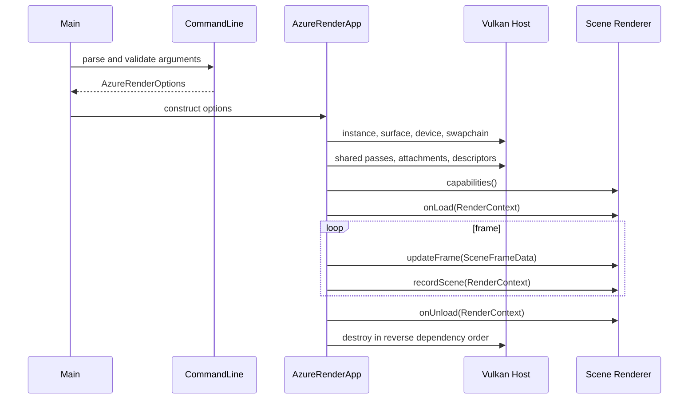
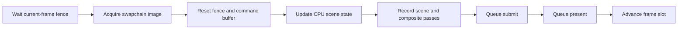
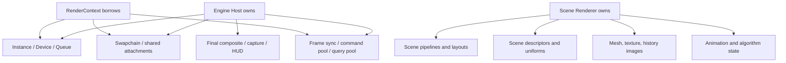

# 渲染器架构与 Vulkan 实现

AzureRender 把 Vulkan 宿主和场景算法分开。宿主管理设备、Swapchain、公共 Attachment 和帧同步。它也负责 Capture 和最终合成。

当前的 `ISceneRenderer` 只把场景写入 HDR Scene Color、Depth 和 Normal。Character、Blackhole 和 Sample Renderer 因此可以共用一个应用。主帧循环不需要为每个场景增加特殊分支。

模块库、项目配置与独立 Player 的依赖和生命周期见 [引擎基础](runtime/engine-foundation.md)。

## 设计目标

架构由四个约束驱动：

1. **多场景**：网格光栅、全屏程序化模拟和未来 Renderer 使用同一宿主。
2. **明确所有权**：任何 Vulkan Handle 都应能回答由谁创建、何时有效、由谁销毁。
3. **可验证**：CLI、Schema、生命周期、资源定位和 GPU 输出都有自动化或实机门禁。
4. **可发布**：开发树和安装树使用同一资源定位逻辑，EXE 不依赖源码绝对路径。

项目不是通用商业引擎，也没有承诺动态 DLL 插件 ABI。当前 SDK 是稳定版本号约束下的进程内 C++ 接口。

## 给 C++ 开发者的 Vulkan 入门

这部分写给懂 C++、但没有使用过 Vulkan 的读者。可以先把 Vulkan 理解成一套需要明确填写参数的 GPU API。OpenGL 常从全局状态判断下一步怎么渲染。

Vulkan 要求程序提前声明对象、资源格式、访问方式和同步关系。驱动做的隐式判断更少，所以应用要自己保证这些信息正确。

### 先建立五个概念

1. **Handle 不是资源本体。** `VkImage`、`VkBuffer`、`VkPipeline` 等类型是不透明 Handle。它们类似外部系统对象的 ID，不能复制其数值来复制 GPU 资源，也不能在仍被 GPU 使用时销毁。
2. **CreateInfo 是显式构造参数。** Vulkan 通常先零初始化 `Vk...CreateInfo`，填写 `sType` 和字段，再调用 `vkCreate...`。结构体让 API 能通过 `pNext` 扩展，而不频繁破坏函数签名。
3. **记录不等于执行。** `vkCmdDraw` 只把命令写进 `VkCommandBuffer`。`vkQueueSubmit` 才会把工作交给 GPU。函数返回时，GPU 也可能仍在执行。
4. **资源和显存是两个对象。** `vkCreateBuffer` 或 `vkCreateImage` 只定义资源，仍需查询内存需求、`vkAllocateMemory`，再用 `vkBindBufferMemory` 或 `vkBindImageMemory` 绑定。
5. **同步和布局描述资源怎么交接。** 假设一个 Pass 刚写完一张颜色图，下一个 Fragment Shader 要读取它。程序要明确告诉 GPU 这两个操作的先后关系。程序还要让写入结果对读取操作可见，并把 Image 切换到合适的 Layout。

最典型的 Vulkan 创建模式在项目中表现为：

```cpp
VkApplicationInfo appInfo{VK_STRUCTURE_TYPE_APPLICATION_INFO};
appInfo.pApplicationName = "AzureRender";
appInfo.apiVersion = VK_API_VERSION_1_3;

VkInstanceCreateInfo createInfo{VK_STRUCTURE_TYPE_INSTANCE_CREATE_INFO};
createInfo.pApplicationInfo = &appInfo;

VkInstance instance = VK_NULL_HANDLE;
vkCheck(vkCreateInstance(&createInfo, nullptr, &instance),
        "vkCreateInstance");

// 所有依赖 instance 的对象都销毁后，才能销毁 instance。
vkDestroyInstance(instance, nullptr);
```

`vkCheck` 是 AzureRender 的错误包装，不属于 Vulkan API。许多 Vulkan 函数会返回 `VkResult`。`vkCheck` 会把错误值和调用名称放进异常信息。

`vkCreateInstance` 的第二个参数用于指定 Host Allocator。项目传入 `nullptr`，表示使用默认分配器。

### 核心对象分别做什么

| Vulkan 对象 | 零基础理解 | AzureRender 中的用途 |
| --- | --- | --- |
| `VkInstance` | 应用与 Vulkan Loader 的会话根对象 | 声明 Vulkan 1.3，启用实例扩展和 Debug Validation |
| `VkPhysicalDevice` | 枚举到的真实 GPU 及其能力 | 检查 Queue、Swapchain、RGBA16F 和 Timestamp 支持 |
| `VkDevice` | 针对一个 GPU 建立的逻辑设备 | 创建绝大多数 GPU 资源和 Pipeline |
| `VkQueue` | GPU 工作提交入口 | Graphics Queue 执行命令，Present Queue 显示图像 |
| `VkSurfaceKHR` | 窗口系统可显示表面 | GLFW 只帮助创建此对象 |
| `VkSwapchainKHR` | 可轮换显示图像的队列 | Acquire 一张图，渲染后 Present |
| `VkCommandPool` | Command Buffer 的分配与重置域 | 属于 Graphics Queue Family |
| `VkCommandBuffer` | CPU 记录的 GPU 命令列表 | 每个 in-flight frame 一份 Primary Command Buffer |
| `VkBuffer` / `VkImage` | 线性数据或有格式的图像资源 | 顶点、Uniform、纹理、深度、HDR 和 History |
| `VkDeviceMemory` | Vulkan 的显存对象 | `rhi::GpuAllocator` 通过 Vulkan Memory Allocator 统一创建和释放 Buffer/Image 分配 |
| `VkImageView` | 解释 Image 的格式和子资源范围 | Attachment 与采样器通过 View 使用图像 |
| `VkSampler` | 过滤、寻址和 LOD 规则 | 纹理、Cubemap、Shadow 和屏幕 Attachment 采样 |
| `VkRenderPass` | Attachment 使用阶段和基本依赖合同 | Shadow、Scene、Composite 和 Editor UI Pass |
| `VkFramebuffer` | Render Pass 使用的具体 Image View 集合 | 按 Swapchain Image/离屏目标创建 |
| `VkPipeline` | 已编译的 Shader 与固定功能状态组合 | Character、Blackhole、Composite 等互相独立 |
| `VkDescriptorSet` | Shader 本帧实际访问的资源表 | 绑定 UBO、材质纹理、Shadow Map 和 History |
| `VkSemaphore` | GPU 工作之间的执行依赖 | Acquire 到 Submit、Submit 到 Present |
| `VkFence` | GPU 向 CPU 报告提交完成 | 防止 CPU 复用仍在飞行的帧资源 |

### 从启动函数认识实际 API

AzureRender 的初始化不是一个黑箱，主要顺序可以直接映射到 Vulkan API：

| 阶段 | 关键 API | 为什么必须按此顺序 |
| --- | --- | --- |
| 创建实例 | `vkCreateInstance` | 其他 Vulkan 对象都从 Instance 或 Device 派生 |
| 安装调试回调 | `vkCreateDebugUtilsMessengerEXT` | Debug 构建接收 Validation 的错误和警告 |
| 创建窗口表面 | `glfwCreateWindowSurface` | Device 选择前需要确认 GPU 能否向该表面 Present |
| 枚举 GPU | `vkEnumeratePhysicalDevices`、`vkGetPhysicalDeviceProperties` | 先查询能力，再选择满足合同的 GPU |
| 查找 Queue Family | `vkGetPhysicalDeviceQueueFamilyProperties`、`vkGetPhysicalDeviceSurfaceSupportKHR` | Graphics 能力与窗口 Present 能力不一定属于同一 Family |
| 创建逻辑设备 | `vkCreateDevice`、`vkGetDeviceQueue` | 启用所需 Feature/Extension 并取得 Queue Handle |
| 查询 Surface | `vkGetPhysicalDeviceSurfaceCapabilitiesKHR` 等 | 决定图像数量、格式、显示模式和尺寸 |
| 创建交换链 | `vkCreateSwapchainKHR`、`vkGetSwapchainImagesKHR` | 获得由显示系统管理的 Color Image |
| 创建命令资源 | `vkCreateCommandPool`、`vkAllocateCommandBuffers` | CPU 才能开始记录 GPU 命令 |
| 创建同步对象 | `vkCreateSemaphore`、`vkCreateFence` | 帧循环开始前就要有可追踪的完成条件 |

对应实现位于 `src/app/AzureRenderApp.cpp`。可以先读 `createInstance()`、`pickPhysicalDevice()` 和 `createLogicalDevice()`。然后读 `createSwapchain()`、`createCommandPool()`、`createCommandBuffers()` 和 `createSyncObjects()`。这些函数连起来就是完整的 Vulkan 启动过程。

### 一帧到底发生了什么

项目的 `src/app/AzureRenderFrame.cpp::drawFrame()` 是理解 Vulkan 最重要的入口。一次普通帧按以下顺序运行：

```text
vkWaitForFences                 CPU 等待当前帧槽上一次提交结束
vkAcquireNextImageKHR           从 Swapchain 取得本次可渲染图像编号
vkResetFences                   把 Fence 恢复为未完成状态
vkResetCommandBuffer            清空上次记录的命令
vkBeginCommandBuffer            开始记录
  vkCmdBeginRenderPass          开始一个使用具体 Attachment 的 Pass
  vkCmdBindPipeline             选择 Shader 和固定功能状态
  vkCmdBindDescriptorSets       绑定 Shader 将访问的 Buffer/Image
  vkCmdBindVertexBuffers        绑定网格顶点（全屏三角形不需要）
  vkCmdBindIndexBuffer          绑定网格索引（全屏三角形不需要）
  vkCmdDraw / vkCmdDrawIndexed  记录绘制
  vkCmdEndRenderPass            结束 Pass
vkEndCommandBuffer              结束记录
vkQueueSubmit                   将命令提交给 Graphics Queue
vkQueuePresentKHR               等待渲染完成后显示 Swapchain Image
```

这里有两个容易混淆的编号。`currentFrame_` 表示当前帧槽，范围是 `0..kMaxFramesInFlight-1`。Command Buffer 跟随这个帧槽。

`imageIndex` 是 Acquire 返回的 Swapchain Image 编号，最终 Framebuffer 通常按它选择。`currentFrame_` 和 `imageIndex` 不一定相等。

`vkAcquireNextImageKHR` 取得一张 Swapchain Image。图像可用后，GPU 会信号 Image Available Semaphore。

`vkQueueSubmit` 等待这个 Semaphore，再开始执行渲染命令。渲染完成后，它会信号 Render Finished Semaphore。`vkQueuePresentKHR` 等待 Render Finished，然后显示图像。

Fence 用来通知 CPU 某次提交已经完成。CPU 在复用当前帧的 Uniform、Command Buffer 或 Capture 资源前会等待对应 Fence。

### 为什么 Buffer 上传需要这么多调用

离散 GPU 的快速显存通常不能由 CPU 直接写入，因此静态资源采用 Staging：

1. `vkCreateBuffer` 创建 Host Visible 的 Staging Buffer。
2. `vkGetBufferMemoryRequirements` 查询尺寸和 Memory Type Bits。
3. `vkAllocateMemory` 分配匹配 `HOST_VISIBLE | HOST_COHERENT` 的内存。
4. `vkBindBufferMemory` 把 Buffer 与内存绑定。
5. `vkMapMemory` 得到 CPU 指针，用 `memcpy` 写入数据，再 `vkUnmapMemory`。
6. 创建带 `TRANSFER_DST` 用途的 Device Local Buffer。
7. 在一次性 Command Buffer 中记录 `vkCmdCopyBuffer`。
8. 提交并等复制完成，然后销毁 Staging Buffer 和它的内存。

纹理上传使用 `vkCmdCopyBufferToImage`。复制前，Pipeline Barrier 把 Image 从 `VK_IMAGE_LAYOUT_UNDEFINED` 切换到 `VK_IMAGE_LAYOUT_TRANSFER_DST_OPTIMAL`。复制完成后，再切换到 `VK_IMAGE_LAYOUT_SHADER_READ_ONLY_OPTIMAL`。

Layout 会告诉驱动后面怎样使用这张图。驱动也可以据此选择合适的内部存储方式。

`src/render/VulkanHelpers.cpp` 和宿主资源代码封装了这些操作。调用者仍然拥有创建出的 `VkBuffer`、`VkImage` 和 `VkDeviceMemory`。它也负责按顺序释放这些对象。

### Descriptor、Pipeline 和 Draw 的关系

可以把一次 Draw 理解为三类输入的组合：

- **Pipeline** 决定“怎样执行”：Vertex/Fragment Shader、顶点布局、深度测试、混合、剔除和 Render Pass 兼容性。
- **Descriptor Set** 决定“读取什么”：相机 UBO、材质纹理、环境 Cubemap、Shadow Map 等。
- **Push Constant** 提供少量高频值，比如当前 Draw 的材质标记。它有严格的容量上限，不能代替普通 Uniform Buffer。

创建 Descriptor 要经过几个步骤。`vkCreateDescriptorSetLayout` 先定义 Binding。`vkCreateDescriptorPool` 提供分配空间。

`vkAllocateDescriptorSets` 从 Pool 中取得 Set。最后，`vkUpdateDescriptorSets` 把具体的 Buffer 或 Image 写进 Set。

GLSL 中的 `layout(set = ..., binding = ...)` 必须和 C++ 的 `VkDescriptorSetLayoutBinding` 一致。类型、数量和 Shader Stage 都要匹配。任何一项写错都可能触发 Validation 错误，也可能直接得到错误画面。

`vkCreateShaderModule` 把 CMake 生成的 SPIR-V 创建成 Shader Module。`vkCreateGraphicsPipelines` 再组合 Shader、Vertex Input、Rasterization、Depth/Stencil、Blend、Viewport 和 Pipeline Layout。组合结果就是 Graphics Pipeline。

创建 Vulkan Pipeline 的成本较高。AzureRender 会在场景加载或配置变化时创建它。每帧绘制只用 `vkCmdBindPipeline` 选择已有 Pipeline，不会为每个 Draw 重新创建。

### 同步错误为什么难调

Vulkan 同步同时回答两个问题：

1. **执行依赖**：后一个操作什么时候可以开始？Semaphore、Fence 和 Pipeline Stage 参与回答。
2. **内存依赖**：前一个写入什么时候对后一个读取可见？Access Mask、Stage Mask 和 Image Layout Transition 参与回答。

只有执行顺序还不够。缺少正确的内存可见性时，后一个操作仍可能读到旧数据。到处调用 `vkDeviceWaitIdle` 可以暂时掩盖一部分问题，但也会让 CPU 和 GPU 失去并行。

AzureRender 只在退出、Swapchain 重建和安全热重载时等待 Device Idle。普通帧使用 Fence 和 Semaphore 完成同步。

常见症状与检查方向：

| 症状 | 优先检查 |
| --- | --- |
| 偶发闪烁或只在部分 GPU 出错 | Barrier 的 Source/Destination Stage 与 Access Mask |
| Resize 后黑屏或 Validation 报旧对象 | Swapchain 依赖对象是否全部重建，旧资源是否仍被引用 |
| CPU 写入后 GPU 偶尔读到上一帧 | 是否按 in-flight frame 分配数据，Fence 是否保护复用 |
| Descriptor 报 Invalid Handle | Descriptor 指向的 Image View/Buffer 是否先被销毁 |
| Pipeline 创建失败 | Shader 接口、Attachment Format、Pipeline Layout 是否一致 |
| 画面方向上下颠倒或深度异常 | Vulkan NDC、Viewport Y 和 Depth Range 约定 |

Debug 构建会开启 `VK_LAYER_KHRONOS_validation`。它能发现许多生命周期、绑定和同步错误。不过，它无法判断画面是否符合美术目标，也找不到所有跨帧语义错误。项目还会使用固定 Capture、诊断视图和 RenderDoc 来检查这些问题。

### 推荐阅读顺序

零基础读者不需要先通读 Vulkan 规范。按项目中的实际数据流阅读更容易建立上下文：

1. `src/app/AzureRenderApp.cpp`：Instance、Device、Swapchain、Command 与同步对象的创建和销毁。
2. `src/app/AzureRenderFrame.cpp::drawFrame()`：Acquire、记录、Submit、Present 和 Resize 分支。
3. `src/render/VulkanHelpers.cpp`：Buffer、Image、显存、上传和 Layout Transition。
4. `src/app/AzureRenderDescriptors.cpp`：Layout、Pool、Set 和 `vkUpdateDescriptorSets`。
5. `src/app/AzureRenderPipeline.cpp`：SPIR-V 到 Graphics Pipeline，以及固定功能状态。
6. `src/scenes/CharacterSceneRenderer.cpp`：网格、多材质、Shadow/Main Pass 如何落入公共宿主。
7. `src/scenes/BlackholeSceneRenderer.cpp`：全屏 Trace 与时间 History 如何复用同一宿主。

阅读每个 Vulkan Handle 时始终问四个问题：谁创建、谁拥有、GPU 何时不再使用、由谁销毁。能回答这四项，就已经抓住了本项目 Vulkan 工程工作的核心。

## 模块划分

| 目录 | 职责 |
| --- | --- |
| `src/app` | 应用生命周期、命令行落地、Vulkan 对象创建、帧循环、Capture 与 Timing |
| `src/render` | 公共 RenderSettings、RenderContext、环境资源和 Vulkan 辅助函数 |
| `src/scenes` | Character、Blackhole、Sample 三个 Renderer 和内置 Catalog |
| `src/extensions` | Renderer/Feature/Importer 接口及 Registry |
| `src/assets` | glTF、材质 Profile、纹理、骨骼、动画加载 |
| `src/editor` | ImGui 编辑器、场景文档、历史、相机与会话命令 |
| `src/resources` | 开发树、构建树和安装树资源解析 |
| `src/diagnostics` | 运行诊断、GPU 能力报告和结构化错误 |
| `shaders` | GLSL Shader。CMake 使用 `glslc` 生成 SPIR-V |
| `tests` | 不依赖可见窗口的契约与逻辑测试 |
| `tools` | 配置、资产处理、视觉 QA、安装验证和发布门禁 |

`AzureRenderApp` 持有 GPU 宿主资源。资源、Pipeline、Descriptor、帧循环、Capture 和辅助代码分别实现同一应用对象的职责。源码以编辑与运行时变体编译到 AzureRenderHost 和 AzurePlayerHost，公共渲染库由两个宿主共享。

## 启动过程



程序会在创建窗口前检查命令行参数。然后，它把资源根目录、场景和资产路径解析为绝对路径。应用通过 `SceneRendererRegistry` 创建 `RenderSettings::sceneType` 指定的 Renderer。

宿主会在 `onLoad` 前检查 Renderer 的能力声明。第一个诊断视图必须是 `Beauty`。

## Vulkan Instance、Surface 与 Validation

GLFW 只负责窗口、输入和创建 Vulkan Surface 所需的平台扩展。项目负责：

- 枚举 Instance Extension 和 Validation Layer。
- 在 Debug 构建启用 `VK_LAYER_KHRONOS_validation`。
- 创建和销毁 `VkDebugUtilsMessengerEXT`。
- 将 Validation 消息转为统一的运行诊断。
- 创建 Vulkan Instance、GLFW Surface，并在退出时按依赖倒序销毁。

Release 默认不启用 Validation，因此最终用户不需要安装 SDK Layer。项目会检查 Vulkan 调用的返回值，并记录具体调用名称。调用失败时会抛出明确错误，不会继续使用空 Handle。

## Physical Device、Logical Device 与 Queue

设备初始化会检查 Vulkan 版本、Graphics Queue 和 Present Queue。它也检查 Swapchain、Surface 格式和必要 Feature。当前渲染路径主要使用一个 Graphics Queue。Renderer 可以从 `RenderContext` 取得 Device、Queue Family 和 Command Pool 等对象，但它不拥有这些对象。

GPU 能力报告是结构化诊断，不等同于驱动基准。它用于记录设备、API 能力和必要格式支持，帮助区分“算法错误”和“目标设备不满足契约”。

## Swapchain 与尺寸变化

宿主选择 Surface Format、Present Mode 和 Extent，创建 Swapchain Image View 及每帧同步对象。窗口 resize 或 `VK_ERROR_OUT_OF_DATE_KHR` 会触发重建：

1. 等待会影响旧尺寸资源的 GPU 工作完成。
2. 销毁 Swapchain Framebuffer、Image View 和尺寸相关 Attachment。
3. 创建新 Swapchain 和公共 Attachment。
4. 重建依赖格式或尺寸的公共 Pipeline/Descriptor。
5. 调用活动 Renderer 的 `onSwapchainRecreate()`。
6. 使 Blackhole 等时间 History 失效。

Renderer 不自行持有 Swapchain，也不能缓存跨重建失效的 `sceneFramebuffer`。`RenderContext::sceneFramebuffer` 和 `commandBuffer` 是当帧借用对象。

## 公共 Attachment 和 Render Pass

宿主为场景提供：

| 资源 | 用途 |
| --- | --- |
| HDR Scene Color | 场景线性高动态范围颜色 |
| Depth | 深度测试、内部轮廓和诊断 |
| Normal | 屏幕空间法线边缘与诊断 |
| 2048 Shadow Map | Character 实时阴影及 Shadow Map 诊断 |
| Swapchain Color | Tone Mapping 后的最终显示和 Present |

`SceneRendererCapabilities` 决定场景 Render Pass 需要哪些 Attachment。Character 需要 Depth 和 Normal。纯全屏 Renderer 可以少声明一些几何缓冲。

最终 Pass 读取 HDR Scene Color 和辅助缓冲。它完成内部描边、Bloom、曝光、Tone Mapping 和颜色分级，再写入 Swapchain。

`RenderSettings::RenderPath` 保留三种执行模型：`traditional`、`subpasses` 和 `dynamic`。它们用于渲染路径对照。性能报告必须写明使用了哪一种路径。接口提供这些选项，不代表它们在所有 GPU 上都有相同收益。

## Pipeline 与 Shader

CMake 把每个 GLSL 文件作为显式生成输入：

```text
GLSL source -> glslc -> build/shaders/*.spv -> VkShaderModule -> VkPipeline
```

宿主管理 Background、最终 Composite 和 HUD 等公共 Pipeline。Renderer 管理自己的 Pipeline：

- Character：Shadow、Mesh、Silhouette Outline 等。
- Blackhole：Trace、Temporal Accumulation、Composite。
- Sample：只验证最小 Renderer 生命周期，不需要 Shader。

Pipeline Layout 和 Descriptor Set Layout 都属于 Shader 接口。修改 Binding、Push Constant 或 Attachment 格式时，要同步修改 GLSL 和 C++ Descriptor 写入。测试与[参考表](reference.md)也要一起更新。

Shader Feature Catalog 记录功能 ID、所属 Renderer 和文件集合。构建系统用它检查组合，不需要重复编写场景判断。

## Descriptor 与资源绑定

Descriptor 把 Uniform Buffer、纹理、Sampler 和屏幕 Attachment 绑定到 Shader。Character 为每个材质创建 Descriptor Set。Uniform Buffer 和 Joint Buffer 则按 in-flight frame 分配。这样 CPU 不会覆盖 GPU 仍在读取的数据。

资源绑定遵循三个原则：

1. Binding 位置由 Shader 和 C++ 共同定义，不能依赖隐式顺序。
2. 缺失可选纹理必须绑定类型正确的回退纹理，不能留下未初始化 Descriptor。
3. Loader 只负责解析语义。Renderer 负责把解析结果上传并绑定到 GPU。

Blackhole 使用自己的 Fullscreen Descriptor，将 Raw Trace、两个 History 和当前质量参数传给后续 Pass。公共后处理只读取标准场景输出，不理解黑洞内部噪声或角色材质。

## Buffer、Image 与上传

静态 Mesh、Index 和纹理使用 Staging Buffer 上传到 Device Local 资源。典型流程为：

```text
CPU bytes
  -> host-visible staging allocation
  -> map and copy
  -> one-time command buffer
  -> vkCmdCopyBuffer / vkCmdCopyBufferToImage
  -> image layout transition
  -> device-local resource
  -> release staging resource
```

Uniform、Joint Matrix 和透明排序 Index 每帧都会更新。项目按 `maxFramesInFlight` 为它们分配空间，并保持内存映射。

创建 Image 时要指定 Format、Usage、Aspect、Mip 和 Layout。Sampler 单独描述过滤与寻址规则。`rhi::GpuAllocator` 通过 VMA 处理 Buffer/Image 的内存需求、分配、绑定和释放；上传流程由项目的 RHI 与宿主负责。

## 帧同步与 Command Buffer

默认最多两个 frame in flight。每个槽位拥有 Command Buffer、Image Available Semaphore、Render Finished Semaphore 和 Fence。帧执行为：



Fence 防止 CPU 覆盖仍在使用的帧资源。Semaphore 连接 Acquire、Graphics Submit 和 Present。普通帧不会调用 `vkQueueWaitIdle`。只有退出、Swapchain 重建和编辑器安全热重载会进行设备级等待。

## 每帧渲染流程

活动帧的高层顺序是：

1. 处理窗口、CLI/QA 和编辑器输入。
2. 计算确定性或实时 `deltaSeconds`。
3. 更新相机、转台、动画和编辑器 Gizmo。
4. 等待当前 frame slot 并 Acquire Swapchain Image。
5. 重置 Command Buffer 和 Timestamp Query。
6. 组装 `SceneFrameData`，调用 `updateFrame()`。
7. 组装当帧 `RenderContext`，调用 `recordScene()`。
8. 记录公共最终 Composite、HUD 和 Capture Copy。
9. 提交、Present，并异步读取可用 Timing/Capture 结果。

Character 的 `recordScene()` 会记录 Shadow 和 Main Scene。Blackhole 会记录 Raw Trace、Temporal 和场景输出。宿主不关心场景内部有多少次 Draw。

## GPU Timing 与 Capture

宿主创建 Timestamp Query Pool。Renderer 在约定位置写入各 Pass 的时间戳，宿主记录最终 Composite 的边界。查询结果会换算成毫秒，并输出到 HUD、CSV 或 JSON。这里统计的是 GPU 时间，不包含 CPU 和 Present。

Capture 命令把最终图像复制到 Host Visible Buffer。对应 Fence 完成后，CPU 才会编码 PNG。捕获模式用固定帧率推进模拟。

Manifest 记录尺寸、帧、场景、RenderSettings 和诊断状态，也保存 Renderer 自定义字段。这些信息可以还原截图的生成条件。

## Renderer 插件契约

一个场景实现 `ISceneRenderer`：

```text
capabilities
  -> onLoad
  -> (updateFrame -> recordScene)*
  -> onSwapchainRecreate -> ...
  -> onUnload
```

必需方法：

| 方法 | 责任 |
| --- | --- |
| `name()` | 返回稳定小写 Registry ID |
| `capabilities()` | 声明 Attachment 和诊断视图需求 |
| `onLoad()` | 创建 Renderer 自有 Pipeline、Descriptor 和 GPU 资源 |
| `updateFrame()` | 更新动画、Uniform 和场景 CPU 状态 |
| `recordScene()` | 向当帧 Command Buffer 记录场景 Pass |
| `onSwapchainRecreate()` | 重建尺寸或 Render Pass 相关资源 |
| `onUnload()` | 释放 `onLoad()` 创建的一切资源 |

可选 Hook 可以提供 HUD、Editor Picking、动画控制和 Capture Manifest 扩展。`RenderContext` 中的对象都属于宿主。Renderer 不能销毁其中的 Device、Queue、Command Pool、Render Pass、Framebuffer、Sampler 或 Query Pool。

全部 GPU 显存由宿主持有的 `rhi::GpuAllocator` 统一分配，基于 VMA，在逻辑设备创建后初始化、销毁前关闭。Renderer 通过 `RenderContext::allocator` 借用，不创建私有分配器。Host Visible 分配保持持久映射并保证 Coherent，调用方不需要配对 `vkMapMemory` 与 `vkUnmapMemory`。每帧的 CPU 到 GPU 上传从 `rhi::UploadRingBuffer` 切分，按 In-Flight Frame 分段复用。

`RenderContext::bindlessTextures` 为真时，Renderer 可以使用全局纹理数组代替逐材质 Descriptor Set。Character 在该模式下每帧只绑定一次全局 Set，通过 Push Constant 传递材质槽位起点。设备不支持 Descriptor Indexing 时回退到逐材质固定表，两条路径共用同一份 Shader 源码的条件编译变体。

Renderer 的资源创建与命令录制都经过 `RenderContext::rhi` 与 `RenderContext::commands`。`rhi::IRhi` 覆盖 Descriptor、Pipeline、Sampler、ImageView、Render Pass 和一次性上传，`rhi::ICommandRecorder` 覆盖每帧录制。生产后端是 `rhi::VulkanRhi`，测试后端 `rhi::NullRhi` 在无 GPU 环境记录调用序列。Pass 录制逻辑由单元测试直接断言。

## 场景表示

渲染器每帧消费 `RenderContext::scene` 给出的资源列表与节点列表。单资产运行退化为单节点场景，`.azscene` 承载多资源与多节点。首个资源是主角资产并保留完整蒙皮与动画，其余资源按绑定姿势渲染。实例按资源分组进入实例存储缓冲，顶点 Shader 经 `gl_InstanceIndex` 取变换与 Joint 偏移，视锥剔除默认开启且开关两侧画面要求像素一致。

内置 Catalog：

| ID | 能力 |
| --- | --- |
| `character` | geometry、editor、capture |
| `blackhole` | fullscreen、temporal、capture |
| `sample` | sdk-example、capture |

新增 Renderer 时，可以从 `SampleSceneRenderer` 开始。先在 `BuiltinRendererCatalog::createRegistry()` 注册 Factory，再通过 `shaderFeatures()` 声明 Shader 归属。Registry 会拒绝重复 ID、未知依赖和不兼容的 API 版本。

## 资源所有权



销毁顺序和创建依赖相反。先销毁使用 Image View 的 Framebuffer 和 Descriptor，再销毁 Image View、Image 和 Device Memory。Pipeline 要在 Pipeline Layout 和 Descriptor Set Layout 之前销毁。`onUnload()` 还要能清理只完成了一部分的初始化过程，而且不能抛出异常。

## 数据契约和版本

| 契约 | 当前版本 |
| --- | ---: |
| `ISceneRenderer` API | 1 |
| `RenderSettings` | 7 |
| `.azscene` | 3 |
| glTF Material Profile | 1 |
| Face SDF Profile | 1 |
| Showcase Look Catalog | 1 |

旧 `.azscene` 和旧 RenderSettings 通过明确的迁移代码读取。程序会拒绝未知的未来版本，不会按旧默认值解释新数据。JSON Schema 和测试共同检查资产 Profile。

## 第三方库边界

| 依赖 | 使用范围 | 未承担的职责 |
| --- | --- | --- |
| Vulkan SDK | Headers、Loader、`glslc`、Validation | 场景架构、资源生命周期、Shader 算法 |
| GLFW | Window、Input、Surface Extension | Swapchain、帧同步、Render Pass |
| Dear ImGui | Editor UI | 场景序列化、Renderer 和资产系统 |
| tinygltf | glTF 容器解析 | GPU 上传、材质语义和渲染 |
| stb | 图片与辅助文本处理 | 纹理资源管理和颜色管线 |
| nlohmann/json | JSON 读写 | Schema 设计和版本迁移策略 |

## 已知架构边界

- 进程内 Renderer Registry 已稳定，动态二进制插件尚未建立 ABI、版本协商和卸载隔离。
- GPU 显存由 VMA 分配器管理。预算追踪与碎片分析按实测需求扩展。
- 公共环境光包含 GPU 预过滤 IBL，环境资源格式与降级规则见 [环境资源](runtime/environment-assets.md)。
- 编辑器热重载会在安全边界等待 GPU idle，正确但不适合高频自动监听。
- Scene Renderer 能力目前主要描述 Depth/Normal，未来更复杂 Render Graph 需要更细的资源声明。
- RenderDoc GPU Marker/Object Name 尚应进一步系统化，外部帧分析的可读性仍有提升空间。

这些边界是后续演进方向，不影响当前 Character、Blackhole、Capture 和发布树的既有契约。

## R1 同步与窗口生命周期

图像和缓冲区屏障使用 `ICommandRecorder`，阶段与访问掩码的规则见[同步契约](runtime/rhi-synchronization.md)。单图形队列内的资源依赖由命令录制顺序与屏障共同表达。

Windows 交换链重建通过 `waitForDrawableSurface` 等待有效尺寸。最小化时等待事件，恢复后先检查设备空闲，再重建附件和场景资源。等待期间关闭窗口会终止重建。
