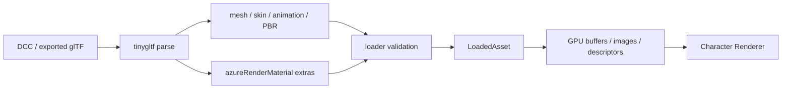

# 资产、场景与编辑器

项目编辑入口为 `AzureRender.exe --editor-project <project.azureproject>`。导入、组件编辑、运行控制和游戏界面见 [项目编辑与游戏表现](runtime/editor-game-ui.md)。

AzureRender 会分开检查两件事：文件能否解析，以及其中的数据能否正确渲染。glTF 提供几何、动画和标准材质字段。AzureRender Material Profile 补充风格化类别、Feature、Face SDF 和类别参数。`.azscene` 保存场景节点、资源引用和 RenderSettings。

## 资产边界

| 目录 | 用途 | 可进入公开仓库/CI | 可进入安装包 |
| --- | --- | ---: | ---: |
| `assets_public/` | 自制或可再分发测试资产 | 是 | 是 |
| `assets_private/` | 授权受限的本机美术 QA | 否 | 否 |
| `assets_placeholder/` | 缺失私有资产时的目录与说明 | 是 | 按需 |
| `portfolio/` | 精选公共截图、证据和哈希 | 是 | 默认否 |
| `captures/` | 可再生成的本机输出 | 否 | 否 |

私有角色的截图、视频和重新打包 GLB 仍可能受原许可限制。没有提交原始模型，不代表这些派生内容可以公开。公共 CI 使用 `assets_public/test_model.gltf`，任何贡献者都能复现基础渲染路径。

## glTF 导入流程



Loader 支持 `.gltf` 和 `.glb`，读取 Buffer、Accessor、Primitive、Node、Skin、Animation、Texture、Sampler 和 Material。导入时检查：

- Accessor 范围、Stride 和 Component Type。
- Index 是否引用合法顶点。
- Normal/Tangent/UV 是否满足当前 Pipeline。
- Joint/Weight 数量与权重归一化。
- Texture 与 Image 引用是否存在。
- Alpha Mode、Double Sided 和材质类别是否兼容。
- AzureRender Profile Schema 和 Face SDF Profile 是否完整。

错误信息要包含资产、Material 或 Primitive 上下文。可选数据可以使用明确的回退值。结构损坏和未知的未来 Schema 必须拒绝。

每个 glTF Primitive 最多支持两个 Morph Target。超过上限时，Loader 会报告目标数量并拒绝导入。

## Material Profile v1

Profile 位于 glTF Material 的 `extras.azureRenderMaterial`。简化示例：

```json
{
  "schemaVersion": 1,
  "class": "hair",
  "features": ["stylized-shadow", "hair-anisotropy"],
  "styleParameters": [1.0, 1.0, 0.5, 0.0],
  "featureParameters": [1.0, 1.0, 0.0, 0.0]
}
```

Schema 只定义数据结构和值域。向量中每个分量的含义由材质类别决定。这样可以减少重复字段，但写入工具必须先知道目标类别。

普通 Lit 材质使用 Style Vector 保存 Toon、Shadow、Specular 和 Rim 参数。Brow Overlay 会把同一个字段解释为局部厚度、偏移和保留值。

Material Class 与 Feature 完整枚举见[参数与接口参考](reference.md)。修改 Profile 时运行：

```powershell
python .\tools\validate_material_profiles.py .\assets_public\test_model.gltf
```

外部工具以 `schemas/azure_render_material.schema.json` 为结构依据。运行时以 C++ Loader 为准。两边必须保持同步。

## 纹理与颜色空间

颜色纹理和数据纹理必须区分：

| 数据 | 典型颜色空间 | 说明 |
| --- | --- | --- |
| Base Color / Emissive | sRGB | 采样后转换到线性空间参与光照 |
| Normal / HN | Linear | 通道是向量数据，禁止 sRGB 解码 |
| Metallic/Roughness/Packed P | Linear | 通道是标量数据 |
| Face SDF / Mask / AO | Linear | 距离或遮罩数据 |
| HDR Environment | Linear HDR | 保留大于 1 的能量 |

Normal Map 使用 Tangent Space。模型缺少 Tangent 时，Loader 可以根据 Position、UV 和 Normal 生成。镜像 UV、退化 UV 和不连续顶点需要单独处理。BC5 等双通道法线要在离线工具中转换或解码，不能当作普通彩色 PNG。

角色头发的 HN 与 P 具有专用命名和 Binding，不能只依赖常规 `T_RGBA_P` 规则。导入工具应输出材质、纹理索引和通道审计，证明数据真正进入最终 GLB。

## Face SDF 资产契约

Face 材质除 `face-sdf-eligible` 外，还需要：

```json
{
  "faceSdf": {
    "schemaVersion": 1,
    "texture": 12,
    "texCoord": 0,
    "channel": "r",
    "maskChannel": "a",
    "shadowOnLowValues": true,
    "horizontalAxis": "left-to-right",
    "headNode": "Head"
  }
}
```

运行时会验证 Texture、UV、通道、方向和 Head Node。资产兼容审计：

```powershell
python .\tools\audit_face_sdf_compatibility.py `
  .\path\to\character.glb --require-compatible
```

材质 Feature 只表示可以使用某项功能。只有 Profile 和有效 Texture 同时存在，才说明资产提供了真实数据。这个区别可以防止 UI 显示 Face SDF 已开启，而 Shader 实际只采样 2x2 回退纹理。

## 骨骼、蒙皮和动画

Skin 包含 Joint Node 和 Inverse Bind Matrix。每帧最终矩阵概念为：

$$
M_{joint}=M_{node,current}\,M_{inverseBind}
$$

顶点按最多支持的 Joint/Weight 组合混合。导入审计应确认每个顶点权重和接近 1、Joint Index 合法、左右语义骨骼没有误配、Bind Pose 不产生突跳。

动画 Channel 分别控制 Translation、Quaternion Rotation 和 Scale。Sampler 决定关键帧时间和插值方式。角色展示可以暂停、重启，也可以按固定 Capture FPS 推进。确定性捕获不使用墙钟时间。

眉毛和睫毛 Overlay 可能共用一个 Primitive，但内部包含多个拓扑小岛。眼睛、睫毛和眉毛骨骼会分别控制这些小岛。加粗几何时，要先识别眉毛顶点或对应小岛。

不能围绕单一中心缩放整个 Primitive。`tools/audit_brow_mesh.js` 可以检查拓扑、退化三角形、权重和骨骼影响。

## 环境资产

`EnvironmentAsset` 支持：

- 单张等距柱状 HDR/LDR 图。
- 包含六面的目录。

Cubemap 面会按统一方向约定转换为内部等距柱状图，GPU 侧使用共享采样函数。环境资源输出 RGBA16F，保持 HDR 能量。自动投影只依据输入类型选择，不应依赖本机文件名猜测场景。

开发机可传私有 HDRI 做视觉 QA，但发布默认必须有公共、可定位的回退资源。场景文档不能写入作者电脑的绝对路径作为必需依赖。

## Toon Ramp 与 Showcase Look

`toon_ramp_profiles.json` 是分类 Ramp 的版本化源数据，`toon_ramp_atlas.ppm` 是生成结果：

```powershell
python .\tools\build_toon_ramp_atlas.py --check
```

`showcase_looks.json` 保存五套 Character Look。每套 Look 只包含 Grade、Bloom 和 Outline。背景、地台、灯光、材质分类和 Face SDF 不在其中。运行时会检查 Schema 和条目数量，防止 C++ 默认值与 JSON 不一致。

## `.azscene` 场景文档

当前 Scene Schema 为 v3。`SceneDocument` 保存：

```text
sceneId
resources[]
  id, type, path
nodes[]
  id, name, parentId, resourceId
  visible
  translation, rotation, scale
  prefabSource, instanceOf
renderSettings
lights[]
  id, nodeId, color, intensity, radius, enabled
```

`renderSettings.sceneType` 选择场景渲染器。点光源通过 `nodeId` 关联场景节点，节点变换提供世界位置。v1 与 v2 文档读取后使用空光源列表。

v3 保存完整光源数据。程序会拒绝未知的未来版本。

保存场景时，程序先在同一目录写入临时文件，再原子替换目标文件。即使进程中断，原文件也不会只剩一半。`prefabSource` 和 `instanceOf` 目前只保存引用与 Transform 覆盖。项目还没有实现独立的 Prefab 文件展开系统。

## 编辑器组成

Dear ImGui 层提供：

- Scene Outliner：节点层级、选择、可见性和增删。
- Inspector：Transform、Renderer、Look、Face SDF、Shadow、Outline 等设置。
- Asset Browser：资源 ID、路径、存在状态和依赖数。
- Viewport：编辑器相机、Picking、Gizmo 和 Capture。
- Diagnostics/HUD：资源、动画、Renderer、GPU Timing 和错误。

编辑器通过 `EditorSession` 和 `EditorContext` 修改 `SceneDocument`。Panel 不直接持有 Vulkan Handle。Renderer 使用统一的 `RendererSceneState` 向编辑器提供可选资产、模型矩阵、Primitive 数量和选择状态。

`EditorContext` 将场景节点同步到 ECS，并把每个节点关联的全部点光源同步到 `LightComponent::emitters`。场景文档保存完整的光源列表及其节点关联。

## Undo 与 Redo

Undo/Redo 保存完整 `SceneDocument` 快照：

- `Ctrl+Z` 恢复上一状态。
- `Ctrl+Y` 重做被撤销状态。
- 节点、名称、可见性、Transform、Prefab/Instance 和 RenderSettings 都进入历史。
- 新编辑清空 Redo。
- 重新加载场景清空历史。
- 历史上限为 100 个快照。

完整快照较简单，也适合当前场景规模。未来处理大场景时，需要改用差量历史和资源级事务。

## 资产热重载

Asset Browser 通过 `last_write_time` 检测变化，但不会启动后台文件监听。用户显式执行 Reload Assets 后：

1. 在主线程记录 Reload Request。
2. 到安全帧边界等待 GPU idle。
3. 调用活动 Renderer `onUnload()`。
4. 重新定位并加载资产。
5. 调用 `onLoad()` 创建新 GPU 资源。

等待 Device Idle 保证正确性，但会产生明显停顿，因此只适合显式低频操作。热重载不会修改 `.azscene` 路径，也不会自动替换 Missing 资源。

## Capture 与视觉证据

编辑器 Capture 标签只允许字母、数字、连字符和下划线，并输出到本地 `captures/`。它是工作图，不自动成为作品集证据。

正式证据应包含：

- PNG 或 MP4。
- 场景、相机、分辨率、帧率和 RenderSettings。
- Capture Manifest。
- GPU/驱动和构建类型（性能证据需要）。
- SHA-256。
- 对比图或预期观察项。

公开媒体要使用能说明内容的名称，例如 `character_face-sdf_comparison_2560x1440.png`。不要使用 `final_v7_new.png` 这类临时名称。原始批量捕获可以放在时间戳目录中。进入 `portfolio/` 后，文件要改用稳定名称，并由 Manifest 管理。

## 视觉 QA 矩阵

### Character

- 全身正面、脸部正面、三分之四和背面。
- 完整转台中的动画、透明排序和阴影连续性。
- Stylized On/Off。
- Albedo、Normal、Depth、Shadow Visibility、Hair KK、Face SDF、Outline。
- 近景检查眉毛、眼睛和发丝。远景检查轮廓和材质分区。

### Blackhole

- Front 和 Close/Over-Shoulder。
- Photon Ring、Lens、Doppler 不对称和盘面接缝。
- 时间序列中的噪声、拖影和 History Reset。
- Balanced Timing 与 Cinematic 视觉交付分开记录。

自动化检查格式、Schema、数学、资源定位和确定性数据。人工检查构图、层次、噪声、色带和整体美术效果。两者不能互相代替。

### 自动化像素基线

`assets_public/baselines/character/` 保存参与自动比较的公共基线图。用例定义在 `tools/visual_regression_cases.json`，由 `tools/run_visual_regression.py` 执行并接入 CTest。当前覆盖 `beauty`、`albedo`、`world-normal`、`material-id`、`outline`、`direct-diffuse` 六个全身视角和 `face-sdf` 面部近景。

用例必须在公共资产上产出可区分的图像。`hair-kk`、`shadow-tint` 与 `style-mask` 在 `test_model.gltf` 上输出彼此相同的画面，因为该资产没有头发材质与阴影染色数据。它们不进入自动基线，仍由人工检查覆盖。

有意改变画面时，用 `--update-baseline` 重写基线，并在提交说明中记录变化原因。新基线的 SHA-256 随清单更新。

## 导入新资产的检查表

1. 确认许可证和公开范围。
2. 检查模型单位、坐标、UV、法线、切线和拓扑。
3. 检查 Skin、Weight、Animation 和 Bind Pose。
4. 为每个 Material 写入明确 Class 与 Feature。
5. 标记数据纹理颜色空间和通道。
6. 验证 Face SDF、Hair HN/P、Overlay 等专用资源。
7. 运行 Profile、Face SDF 和眉毛审计工具。
8. 使用 Debug Validation 加载。
9. 生成固定视图与隔离图。
10. 只有公共资产才进入 CI、安装包和作品集。
