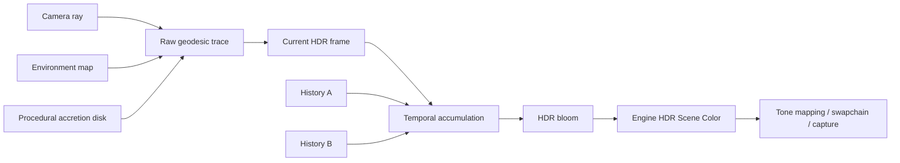

# 黑洞模拟

Blackhole Renderer 使用全屏程序化渲染，不加载黑洞网格。Fragment Shader 从相机生成射线，再沿弯曲路径向前积分。射线会采样吸积盘体密度和环境背景。结果经过时间累积、Bloom 和 HDR 合成后成为最终画面。

本实现以视觉可控和实时稳定为目标，参考 Schwarzschild 黑洞的关键现象，但不是科研级时空求解器。文档中的“物理”描述应理解为实时渲染近似。

## 渲染管线



Renderer 管理 Raw Trace Image、两个 History Image 和时间状态。它也管理自己的 Framebuffer、Pipeline 和 Descriptor。宿主只接收标准 HDR 场景输出。两个 History 轮流读写，避免同一张图在一帧内既作为输入又作为输出。

## 相机与初始射线

每个像素先从 UV 转为归一化设备坐标，根据相机 Forward、Right、Up 和纵横比得到初始方向：

$$
\mathbf{d}_0=\operatorname{normalize}(\mathbf{f}+x\,a\,\mathbf{r}+y\,\mathbf{u})
$$

其中 $a$ 是 Aspect Ratio。相机预设不修改最终图片比例，只改变位置、目标和运动路径。

| 预设 | 用途 |
| --- | --- |
| `front` | 正面观察吸积盘、引力透镜和多普勒不对称 |
| `orbit-left` | 左侧移动观察盘面厚度与背景扭曲 |
| `high` | 侧上方观察盘的空间结构 |
| `close` | 近距离构图，观察噪声、光子环和遮挡 |
| `over-shoulder` | 黑洞位于画面右下、左上保留天空的移动展示 |

切换相机或 resize 时，渲染器会清除 History。否则旧相机的样本会在新视图中形成拖影。

## Schwarzschild 近似与光线弯曲

系统使用以 Schwarzschild Radius $R_s$ 归一化的黑洞空间。重要区域：

- **Event Horizon**：射线进入后终止并输出黑色。
- **Photon Sphere 邻域**：曲率变化最强，需要更细步长。
- **远场**：引力影响减弱，可以扩大步长。

实时版本不会求解完整的四维测地线。Shader 会逐步更新射线位置和方向，并用指向中心的曲率项近似空间弯曲：

$$
\mathbf{p}_{i+1}=\mathbf{p}_i+\mathbf{d}_i\,\Delta s_i
$$

$$
\mathbf{d}_{i+1}=\operatorname{normalize}(\mathbf{d}_i+\mathbf{g}(\mathbf{p}_i)\,\Delta s_i)
$$

$\mathbf{g}$ 随半径减小而增强，并投影到适合改变方向的分量。射线可能：

1. 进入 Event Horizon。
2. 穿过吸积盘体积并累计辐射。
3. 绕过黑洞后采样扭曲的环境背景。
4. 达到最大距离或最大步骤后退出。

这套近似能够生成 Einstein Ring、Photon Ring 邻域和上下盘面透镜像，但数值不能用于天体物理测量。

## 连续自适应步长

固定小步长成本过高，固定大步长又会漏掉薄盘和高曲率细节。步长根据半径、盘面距离和质量档位连续变化：

$$
\Delta s=\Delta s_{base}\,q_{quality}\,f_{radius}(r)\,f_{disk}(h)
$$

步长在 Photon Sphere 和吸积盘附近变小，远离中心后再逐渐变大。这里必须使用连续函数。按距离切成几个固定档位会产生同心色块和采样边界。

质量档位：

| 档位 | 最大积分步数 | 每像素 Trace | 近场步长比例 | 用途 |
| --- | ---: | ---: | ---: | --- |
| `performance` | 600 | 1 | 0.85 | 快速预览 |
| `balanced` | 1100 | 1 | 0.65 | 交互与 Timing |
| `cinematic` | 1800 | 4 | 0.48 | 截图和视频 |

`cinematic` 的多 Trace 通过像素内扰动采样降低空间噪声，代价近似随采样数和实际迭代次数增长。

## 吸积盘空间模型

吸积盘不是无限薄平面，而是围绕赤道面的发光体密度。采样点转换为柱坐标：

$$
r=\sqrt{x^2+z^2},\qquad \theta=\operatorname{atan2}(z,x),\qquad h=|y|
$$

基础密度由径向包络、垂直厚度、旋臂、云层和尘埃共同决定：

$$
\rho=E_r(r)\,E_h(h,r)\,S(r,\theta,t)\,N(r,\theta,h,t)
$$

- `E_r` 限制内外半径并形成靠近内缘的高能区。
- `E_h` 产生随半径变化的动态厚度。
- `S` 形成旋臂和非均匀结构。
- `N` 是多 Octave 体噪声，允许真实空隙而不是强制非零底密度。

体积分使用前向辐射累积。每个样本按密度和步长贡献颜色与不透明度，达到饱和或离开盘体后可提前退出：

$$
C\leftarrow C+(1-\alpha)\,C_s\,\alpha_s
$$

$$
\alpha\leftarrow\alpha+(1-\alpha)\,\alpha_s
$$

这比单次平面交点更能表达厚度、遮挡和稀疏云团。

## 周期噪声与接缝

`atan2` 的角度会在 $+\pi$ 与 $-\pi$ 之间跳变。如果直接把 $\theta$ 传给普通 Perlin 或 Simplex 噪声，圆周两端就无法连续。吸积盘旋转时，画面会出现一条固定的径向接缝。

实现将角度嵌入圆周：

$$
\mathbf{q}_{angular}=(\cos\theta\,k,\sin\theta\,k,r\,k_r+h\,k_h)
$$

噪声输入在圆周两端具有相同的数值和变化方向。厚度、云层、旋臂扰动和尘埃都要使用这一周期坐标。只修复其中一个分支，画面上仍会留下较弱的接缝。

接缝回归至少检查正面静态图和近距离移动序列。不能通过模糊、降低对比度或把接缝转到镜头背面规避。

## Keplerian 旋转

盘面角速度随半径下降，视觉上近似 Keplerian：

$$
\omega(r)\propto r^{-3/2}
$$

噪声坐标按 $\theta+\omega(r)t$ 推进，所以内盘旋转更快，外盘更慢。时间只移动同一个连续噪声场。Shader 不会每帧生成完全独立的随机密度，因为这种做法会造成 TAA 难以稳定的闪烁。

旋转方向同时决定局部速度，用于多普勒效应。改变盘面旋转但不更新速度符号，会使视觉运动和颜色不对称互相矛盾。

## 多普勒频移与相对论增亮

盘面局部切向速度：

$$
\mathbf{v}=v(r)\,(-\sin\theta,0,\cos\theta)
$$

观察方向与速度的点积决定接近或远离：

$$
\beta_{los}=\frac{\mathbf{v}\cdot\mathbf{d}_{observer}}{c}
$$

使用受控相对论 Doppler Factor：

$$
D=\frac{1}{\gamma(1-\beta_{los})},\qquad
\gamma=\frac{1}{\sqrt{1-\beta^2}}
$$

$D$ 会改变颜色温度。接近观察者的一侧偏蓝白，远离的一侧偏红。亮度近似乘 $D^3$，用来表现 Relativistic Beaming。

Shader 会限制极端值，避免 HDR 能量失控。这个上限不能太低，否则盘面两侧会重新变得对称。

验收时正面盘面必须明显不对称。如果画面左右几乎相同，应检查相机方向、速度切线、点积符号、Doppler Clamp 和 Tone Mapping，而不是只提高色彩饱和度。

## 引力红移

靠近 Event Horizon 的辐射到达远处观察者时发生红移和能量降低。实时近似根据发射半径构造 Redshift Factor，并与 Doppler 共同作用：

$$
g_{grav}\approx\sqrt{1-\frac{R_s}{r}}
$$

最终辐射的概念组合为：

$$
C_s=C_{temperature}(D\,g_{grav})\,D^3\,E(r)\,\rho
$$

靠近内缘的基础发射更强，但引力红移和 Event Horizon 吸收限制其最终显示。所有值在线性 HDR 中计算，不能在 Trace 阶段过早 Clamp 到 0-1。

## 环境与引力透镜

没有进入 Event Horizon 的射线会在积分结束后采样环境贴图。采样使用射线弯曲后的最终方向，所以背景星空也会弯曲。环境可以是等距柱状 HDR，也可以来自六面 Cubemap。加载器会把两种输入转换成同一种内部表示。

黑洞本身不需要传统环境光照，但背景图是判断透镜方向、相机运动和 Photon Ring 的关键参照。纯黑或低信息背景会隐藏算法错误，不适合作为唯一验收环境。

## 时间累积与 TAA

Raw Trace 在高曲率与稀疏密度区域具有空间噪声。Temporal Pass 把当前帧与上一 History 混合：

$$
H_t=(1-w)H_{t-1}+wC_t
$$

`w=1` 表示完全丢弃 History。普通连续帧会根据目标半衰期、帧间隔和质量档位计算权重。Capture 使用固定时间步长，保证重复运行得到一致结果。

History 必须在以下情况重置：

- 质量档位改变。
- 相机预设、位置或非连续旋转改变。
- Swapchain resize。
- Capture 开始或时间线跳变。
- Renderer 重新加载。
- History 尺寸或格式变化。

不重置 History 会留下旧画面的拖影。每帧重置又会让 TAA 完全失效。时间半衰期需要在降噪和保留旋转细节之间取得平衡。

当前 Temporal Shader 同时从 HDR 高亮提取小范围 Gaussian Bloom。它是黑洞内部稳定高亮的一部分，最终仍通过宿主 Tone Mapping 输出。

## HDR 合成

Trace 输出保持在线性 HDR 中。内盘、Photon Ring 和 Beaming 的数值都可以超过 1。Temporal 和 Bloom 处理后，结果写入宿主的 HDR Scene Color。公共最终 Pass 再应用 Exposure 和 Tone Mapping。

过早 Clamp 会把高亮变成没有层次的色块。只降低曝光又会压暗外盘。可以按下面的顺序检查：

1. Raw Trace 密度是否连续。
2. Doppler 两侧相对能量是否合理。
3. Temporal 是否保留稀疏结构。
4. Bloom 是否只扩散高亮。
5. Tone Mapping 是否保留内盘颜色层次。

## 性能特征

Blackhole 的成本主要来自实际积分步数和每像素 Trace 数。输出分辨率和盘面命中率也会影响耗时。最大步数只是上限，并非每个像素都会执行满。射线进入 Event Horizon、到达远场或 Alpha 饱和后都可以提前退出。

GPU Timing 使用 Timestamp Query 分离 Shadow（黑洞仅做兼容清理）、Main Scene 和 Post Process。报告数据时必须注明：

- GPU 与驱动。
- 分辨率和质量档位。
- 相机预设。
- 样本/帧数和 Warm-up。
- Debug 或 Release。
- Timing 不含 CPU、Present、Readback 和编码。

已有代表性本机数据只可作为该机器上的基线，不能推广为所有 GPU 的性能承诺。

## 确定性回归

推荐捕获：

```powershell
.\build\ninja-release\AzureRender.exe `
  --scene-type blackhole `
  --blackhole-quality cinematic `
  --blackhole-camera front `
  --width 1280 --height 720 `
  --capture-dir .\captures\blackhole\regression-a `
  --capture-frames 36 --capture-fps 60
```

第二次运行写入新目录，再比较同帧：

```powershell
python .\tools\compare_images.py `
  .\captures\blackhole\regression-a\frame_000035.png `
  .\captures\blackhole\regression-b\frame_000035.png `
  --max-mean-error 0.005 `
  --max-changed-ratio 0.01 `
  --output .\captures\blackhole\comparison.json
```

基准必须和 Manifest、命令、分辨率、设置及 SHA-256 一起保存。只保留一张没有状态信息的图片不能构成可复现证据。

## 视觉验收

### 正面

- Event Horizon 轮廓稳定、纯黑且没有漏光。
- Photon Ring 连续，不出现方块或离散半径色带。
- 上下盘透镜像可辨认。
- 接近侧明显更亮更偏蓝，远离侧更暗更偏红。
- 吸积盘存在稀疏空隙，而不是均匀平滑圆环。

### 近距离与移动视角

- 盘体厚度和旋臂连续。
- `atan2` 边界没有固定径向接缝。
- TAA 不产生明显残影或冻结噪声。
- 相机切换后的首帧不混入旧视角。
- HDR 高亮有颜色层次，不是大面积纯白。

### 回归边界

Blackhole 已作为 P1 完成场景冻结。角色或宿主改动不能意外改变它的 Shader、质量参数、相机语义和 History Reset。公共 Attachment 或后处理发生变化后，要重跑黑洞正面和近距离回归。

## 已知近似与限制

- 曲率更新是实时视觉近似，不是完整 Kerr/Schwarzschild 测地线科研求解。
- 当前不模拟黑洞自旋、Frame Dragging、磁流体动力学或真实光谱传输。
- 吸积盘是程序化密度，不来自 GRMHD 数据集。
- Temporal Accumulation 没有完整 Motion Vector Reprojection，依赖相机契约和 History Reset。
- 高分辨率 Cinematic 的成本高，正式性能比较应优先使用 `balanced`，视觉交付再使用 `cinematic`。

这些限制应在作品集和报告中明确说明。项目的价值在于实时图形算法、稳定性与可控视觉实现，而不是宣称物理精度超出实际能力。
