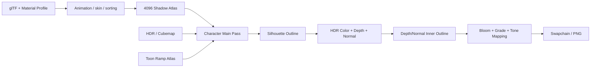

# 风格化角色渲染

Character Renderer 负责还原角色资产中的分层美术信息。它不会把所有表面都套入同一个 PBR 模型。脸、皮肤、头发、布料、金属和眼睛各有自己的规则。

透明覆盖层和展示地台也单独处理。它们最终都会写入同一组 HDR Scene Color、Depth 和 Normal，并使用公共 Capture 与诊断系统。

## 帧管线



高层执行顺序：

1. 更新节点动画、Joint Matrix、Morph Weight 和模型转台。
2. 计算透明 Primitive 的视图相关排序索引。
3. 从固定世界主光记录 Shadow Pass。
4. 记录背景、展示地台和角色主材质。
5. 对需要的材质记录背面壳 Silhouette Outline。
6. 公共后处理从 HDR Color、Depth 和 Normal 提取内部边缘并完成显示映射。

角色绕双脚中心旋转，而不是绕模型原点。脚底中心由低高度顶点的稳健统计估计，避免武器尖端或附件改变转轴。世界主光保持不随模型旋转，因此完整转台中能观察到连续的受光、背光和投影变化。

## glTF 数据进入 GPU

`GltfLoader` 读取：

- Position、Normal、Tangent、UV、Color、Joint 和 Weight。
- Index、Primitive、Node 层级、Skin 和 Inverse Bind Matrix。
- Animation 的 Translation、Rotation、Scale 通道。
- glTF 标准 PBR 字段、Alpha Mode、Double Sided。
- `extras.azureRenderMaterial` 中的 Material Profile。

Loader 在 CPU 侧生成 `LoadedAsset`。`CharacterSceneRenderer` 把网格和纹理上传到 GPU。它还为每个材质创建 Descriptor，并为每个帧槽创建 Uniform Buffer 和 Joint Buffer。

缺少纹理时，Renderer 会绑定类型正确的回退资源。Descriptor 不会留下空 Binding。

CPU 根据动画计算节点世界矩阵与关节矩阵，写入当前帧槽的关节缓冲。Compute 蒙皮生成位置、法线和切线，顶点着色器提供兼容路径。静态模型使用单位蒙皮矩阵。

## 材质分类

Material Profile v1 使用明确类别而不是材质名称猜测：

| 类别 | 主要约束 |
| --- | --- |
| `generic` | 常规 fallback，保持保守材质响应 |
| `skin` | 介电质、暖色阴影、限制金属度和镜面能量 |
| `face` | Skin 约束加 Face SDF |
| `hair` | HN/P、Hair AO、双层 Kajiya-Kay、色相保护 |
| `fabric` | 强 Toon 分区、AO 与较低镜面 |
| `metal` | 保留完整金属响应和环境镜面 |
| `eye` | 高可读镜面与独立 Ramp |
| `overlay` | 透明、非标准深度/混合行为 |
| `emissive` | 自发光主导 |
| `showcase` | 展示地台等场景辅助材质 |

Profile 的 `features` 用来开启具体能力，比如 `stylized-shadow`、`hair-anisotropy` 和 `face-sdf-eligible`。其他可选能力包括 `emissive-mask`、`overlay`、`neutral-fallback` 和 `brow-overlay`。材质类别决定基础规则，Feature 只负责开关功能。两者不能互相代替。

皮肤、脸和头发限制金属度，眼睛使用介质响应。
衣料保留金属遮罩，扣件与纤维共享分类材质。
金属类使用贴图底色作为法向反射率。

普通表面、衣料、金属和地台使用 GGX 高光。
可见度采用高度相关的 Smith 项。
菲涅耳项由视线与半角方向计算。
源介质参数 0.5 对应 4% 的法向反射率。

粗糙度保留贴图值，并叠加法线方差过滤。
主光和局部光各自提供颜色与光源强度。
分类材质参数继续控制风格强度和高光遮罩。

## Toon Ramp 与明暗分区

传统 Lambert 项为：

$$
N\!L = \max(\mathbf{n}\cdot\mathbf{l}, 0)
$$

AzureRender 不直接把它作为最终亮度，而是生成 Ramp 坐标：

$$
u_r = \operatorname{clamp}(N\!L + \Delta_{threshold} + \Delta_{style}, 0, 1)
$$

材质类别决定采样 `toon_ramp_atlas.ppm` 的哪一行，$u_r$ 决定横向坐标。Skin 和 Face 使用连续的暖色过渡。Hair、Fabric 和 Metal 使用更清楚的明暗分区。

Ramp 数据保存在带版本的 JSON 中，工具会根据它生成 Atlas。参数检查失败时，程序不会悄悄改用编译期常量。

最终漫反射不是单一乘法：

$$
C_{diffuse}=C_{ambient}\,V_{ambient}+C_{direct}\,R(u_r)\,V_{shadow}
$$

其中 `V_shadow` 来自实时 Shadow Map，`R` 是分类 Ramp，环境可见度也随暗部分区调整。这样环境光能够解释体积，但不能把背光面托成和受光面一样亮。

## 主光与环境光

Character 使用固定世界空间方向光建立可观察的明暗关系，环境贴图提供背景和方向性环境漫反射/镜面。环境图通过世界法线或反射方向采样，不是统一 Ambient 常量。

角色展示 Look 只保存 Grade、Bloom 和 Outline 参数。灯光、材质分类和 Face SDF 不属于 Look。当前 Catalog 包含 Azure Gallery、Endfield Industrial、Neutral Material Check、Specular Rim 和 Rear Emissive。

HDR 合成先计算线性光照、AO、Ramp、镜面、Rim 和自发光。之后才应用 Bloom、Exposure、Tone Mapping、Tint、Saturation 和 Contrast。这个顺序可以避免用曝光掩盖材质错误。

检查皮肤或头发时，要同时查看 Beauty 和 Albedo。这样可以分清问题来自底色还是光照。

## PCSS 软阴影

阴影通道从固定主光记录角色与地台深度。
图集分辨率为 4096×4096，包含四个级联。
每级联使用 2048×2048 纹素。
主通道把世界位置变换为阴影坐标和接收深度。

PCSS 分两步：

1. 用五乘五搜索位置读取相邻深度纹素。
   先比较遮挡，再按双线性覆盖累积深度矩。
   遮挡质量提供平均遮挡深度 $z_b$。
2. 按世界空间遮挡间距估计半影半径。
   对圆盘覆盖的全部纹素加权比较。
   核边界采用一纹素的覆盖过渡。

概念公式：

$$
r_p = \operatorname{clamp}\left(r_c + 0.035\,\frac{d_{world}}{t_{world}},r_c,r_{max}\right)
$$

其中 $d_{world}$ 是接收面与遮挡面的世界间距。
$t_{world}$ 为级联纹素的世界尺寸。
接触半径 $r_c$ 按级联纹素密度缩放。
1024 纹素级联的基准半径为 3。
当前 2048 纹素级联的接触半径为 6。
接触半径始终受配置的最大半径限制。
`maximumFilterRadiusTexels` 默认值为 8。

接收偏置按几何法线和纹素尺寸计算。
平面深度修正在曲率较高的足迹内衰减。
采样坐标始终限制在当前级联内。
根由和指标见[画面根由报告](research/2026-10-09-character-presentation-refinement.md)。

接触位置满足 $z_r\approx z_b$，所以阴影较窄。接收面远离遮挡物后，阴影会逐渐变软。深度 Bias 会同时考虑固定偏移和表面朝向，用来减少 Shadow Acne。Bias 不能过大，否则会出现 Peter Panning。

`shadow-visibility` 隔离图用于检查滤波本身。Beauty 用于检查阴影怎样与 Ramp 和 AO 合成。两个视图都要检查。

## Face SDF

二次元脸部的阴影轮廓通常不是几何法线的等值线。Face SDF 把美术设计的明暗边界编码在纹理中，主光只控制采样方向和阈值。

Material Profile 指定：

- SDF Texture 与 UV Set。
- 距离通道和参与遮罩通道。
- 低值还是高值表示阴影。
- 纹理水平方向的脸部语义。
- 头部节点名称。

只有 `face-sdf-eligible` Feature 还不能启用效果。资产还要提供完整的 `faceSdf` Profile 和有效的头部节点。缺少数据时，Renderer 会绑定回退纹理来保持兼容。此时并没有真实的 Face SDF 明暗。

### 头部局部光照

导入骨骼矩阵的列向量不一定等于模型语义上的左、上、前。实现保存 Bind Pose 的头部基底，再使用当前头部相对 Bind Pose 的旋转，把世界主光转换到稳定的脸部语义坐标：

$$
R_{relative}=M_{head,current}\,M_{head,bind}^{-1}
$$

$$
\mathbf{l}_{face}=R_{relative}^{-1}\mathbf{l}_{world}
$$

横向分量决定左右采样权重，正面分量参与阈值调整。这样角色转动、骨骼动画和模型坐标约定不会把脸长期锁在全亮状态。

### 左右镜像与连续性

左右脸需要在原始 UV 与镜像 UV 之间切换。直接使用 `lateralLight >= 0` 的硬分支会在光线跨过零点时整脸突变。当前用连续权重混合两个方向：

$$
w_{side}=\operatorname{smoothstep}(-\epsilon,\epsilon,l_x)
$$

$$
d=\operatorname{mix}(d_{mirror},d_{original},w_{side})
$$

随后用阈值和 Softness 得到 Face Illumination：

$$
I_{face}=\operatorname{smoothstep}(t-s,t+s,d)
$$

横向混合窗口采用 $\epsilon=0.60$，阈值柔化宽度 $s$ 至少为 0.18。固定相机的 120 帧主光扫描按标注脸部区域检查连续性。

计算结果会按遮罩和权重混入 Ramp 坐标。暗部使用暖色 `faceSdfShadowColor`。SDF 控制设计好的脸部阴影形状。实时 Shadow Map 继续处理头发、附件和环境对脸部的遮挡。

### 验收

Face SDF 的正确性不能只看全局开关：

- Loader 日志应报告真实纹理尺寸和头部节点。
- `face-sdf` 隔离图应出现连续左右灰阶分界。
- 正面、三分之四和完整转台中边界应随光线连续移动。
- Beauty 中脸与同侧肩颈肤色应连续，不能整脸漂白或暗侧发脏。
- 相邻帧不能在侧向光过零时突变。

## 头发数据与 Kajiya-Kay

头发使用三类数据：

| 纹理 | 用途 |
| --- | --- |
| Hair D | Base Color 与透明信息 |
| Hair HN | RG 解码基础发束法线。BA 解码高光方向扰动 |
| Hair P | Metallic/Roughness/Specular 等打包材质数据 |

HN 通过独立的 `hairDataTexture` Binding 上传。Hair P 的命名方式和布料 Packed Map 不同，所以资产注入器要分别识别它们。纹理缺失时，Renderer 会使用回退值，并在 QA 中暴露状态。不能只保留 Shader 公式，却没有绑定真实数据。

Kajiya-Kay 使用发束方向 $\mathbf{t}$ 与 Half Vector $\mathbf{h}$：

$$
S=\sqrt{1-(\mathbf{t}\cdot\mathbf{h})^2}
$$

Shader 使用 HN 的 BA、材质 Shift 和法线来构造两条发束方向。两条方向略有错开，分别产生窄主高光和较宽的次高光。Lobe 经过平滑阈值后形成稳定条带。最终强度还会乘主光、Ramp、视角可见度、材质强度和 Style Mask。

两层高光用来表现发丝方向，不是为了整体提亮。正面和转台画面中都应该看到连续的高光条带。`hair-kk` 隔离图会单独显示它们。

如果隔离图全黑，先检查材质类别、Feature、HN Binding 和参数。提高曝光不能修复数据绑定问题。

## Hair AO 与内部轮廓

Hair AO 是独立的风格化体积层，由以下信号组合：

- 材质 AO Color。
- Style Mask。
- 视线掠射关系。
- HN 发束法线与几何法线偏差。
- 当前 Ramp/阴影区域。

它在漫反射层形成发片内部遮蔽，而不是只把已处于阴影的像素再次压黑。过强会产生脏块，过弱则使发片粘成一整块。

内部轮廓 Pass 同时检查 Depth Edge 和 Normal Edge。Hair 会提高 Shaded Normal 的权重，让发片之间出现细线。Silhouette Outline 只处理角色外轮廓。

这两个效果要分开调节。整体加粗外壳无法补回头发内部层次。

环境镜面可能把红色头发照成灰白。为避免这个问题，Hair 漫反射会在环境和 Toon 合成后恢复一部分 Base Color 色相。Shader 也会限制环境镜面能量。这些处理不能代替 AO、HN 或 KK。

## 眉毛 Overlay

眉毛不是画在 Face Mesh 上的普通不透明纹理，而是独立透明 Primitive。其实现包含：

1. 使用 Face D 对应 UV 区域提供眉毛颜色和形状。
2. 顶点沿 Pixel-to-Camera 方向推出，避免与脸部 Z-Fighting。
3. 使用 Unlit 风格输出和材质常量透明度。
4. 透明 Primitive 按视图更新排序索引。
5. 对真正眉毛顶点做局部、拓扑感知的厚度补偿，保持远景可读。

眉毛卡片的剔除规则由 glTF `doubleSided` 决定。区域选择依据骨骼名称、权重与三角形连接关系，绑定空间的扩展随角色蒙皮运动。`brow-mask` 隔离图保留头发和实体的真实深度遮挡。

原始实例中的 `4.679` 使用厘米单位，glTF 米制路径应转换为 `0.04679 m`。直接使用 `4.679 m` 会把眉毛推离角色。

眉毛 Primitive 可能同时包含眉毛、睫毛和眼部小岛。不同部分由不同骨骼控制，因此不能围绕同一个中心整体缩放。这样做会拉开各个小岛，也会破坏骨骼关系。

网格审计要检查顶点连续性、退化三角形和权重。左右骨骼分配应当对称，且不能包含无关骨骼。

透明排序必须保留 glTF 的全局 Vertex Index。如果把 Index Buffer 偏移再次加到顶点索引上，眉毛就会读取错误顶点。此时即使 Descriptor 和 Shader 都已启用，眉毛仍然不可见。

## 描边系统

角色包含两类描边：

### Silhouette Outline

Silhouette Pass 会为选定 Primitive 绘制背面壳。顶点沿法线外扩，Pipeline 使用 Front Face Culling 和深色材质。宽度在模型或视图尺度中控制。不要整体缩放 Clip Space `xy`，否则头部会过宽，远近宽度也会不一致。

透明 Overlay、展示地台和不应产生外壳的材质跳过该 Pass。

### Inner Outline

最终 Composite 在屏幕空间采样 Depth 和 Normal 邻域：

$$
E=\max(E_{depth},E_{normal})\,S_{outline}
$$

Depth Threshold 控制前后几何的边界。Normal Threshold 检测深度接近、但朝向不同的表面。Hair 使用更高的 Shaded Normal 权重，以保留内部发束。

这个 Pass 还处理诊断显示、Bloom、曝光和 Tone Mapping。修改 Binding 或颜色空间后，要一起测试这些功能。

## 透明、双面与排序

Opaque 和 Mask Primitive 先绘制，并写入深度。Blend Primitive 根据当前视角排序，随后再绘制。眉毛等 Overlay 不能错误写入深度，也要避免自遮挡。

不能直接关闭全部深度关系。Double Sided 来自 glTF 或材质契约，不能只根据名称猜测。

当前透明方案适合角色数量和材质规模，不是通用 Order-Independent Transparency。多层大面积透明仍可能出现排序限制，应通过固定相机和旋转 QA 检查。

## HDR、Bloom 与显示映射

主场景在线性 HDR 中合成。最终 Pass 的概念顺序为：

```text
HDR scene
  -> thresholded bloom
  -> inner outline
  -> exposure (2^EV)
  -> tone mapping
  -> tint
  -> saturation
  -> contrast
  -> swapchain color
```

Bloom 只提取超过 Threshold 的能量。受光面应该清楚，但不能依靠全局 EV 把 Face 或 Hair 推成纯白。Neutral Material Check 会降低 Bloom 和轮廓干扰，方便检查原始材质响应。

## 诊断视图

| 视图 | 主要排查内容 |
| --- | --- |
| Beauty | 最终视觉组合 |
| Albedo | 原始底色、纹理和分类错误 |
| World Normal | 法线、蒙皮和内部轮廓输入 |
| Depth | 相机比例、深度连续性和边缘输入 |
| Diffuse Band | Toon Ramp 坐标和分区 |
| Shadow Visibility | PCSS 与 Bias，不含其他阴影染色 |
| Hair KK | HN、发束方向和高光能量 |
| Rim/Specular/Emissive | 独立光照分量 |
| Outline | 外壳与屏幕空间边缘 |
| Shadow Map | 主光深度覆盖 |
| Material ID | Primitive 分类和 Profile |
| Style Mask | 风格化参与区域 |
| Ambient/Direct Diffuse | 环境与主光能量分离 |
| Shadow Tint | AO、Ramp 暗部和染色 |
| Face SDF | SDF 遮罩、方向和连续性 |
| Overlay | 眉毛等透明覆盖层 |
| Brow Mask | 可见眉毛区域与真实遮挡 |
| Bloom | HDR 高亮提取 |

## 固定验收方法

一次角色视觉变更至少检查：

1. 公共资产 Debug Validation 120 帧。
2. `full-body-front` Beauty：构图、转轴、全身材质与地台投影。
3. 脸部正面、左右三分之四与左右侧面：肤色、Face SDF、眉毛和头发前方高光。
4. 完整 16 秒转台：插值连续、透明排序、阴影和背面细节。
5. Albedo、World Normal、Shadow Visibility、Hair KK、Face SDF、Outline 隔离图。
6. Stylized On/Off 对照，证明效果来自目标分支而不是曝光或资产变化。

自动化可以验证参数、Schema、捕获状态和像素差，但“发丝是否有层次”“脸部阴影是否自然”仍需要人工视觉判断。人工判断也不能替代 Validation 和资源审计。

固定输入、派生素材、标注格式与执行命令见[角色材质定稿与验收](runtime/character-finish.md)。

## 已知限制

- 当前角色光照是风格化直接光加实用型环境采样，不是完整预过滤 PBR IBL。
- Face SDF 依赖资产提供正确的纹理方向和头部节点。通用自动推断并不可靠。
- 透明层使用排序路径，不是通用 OIT。
- Silhouette 宽度仍受模型单位和导入尺度影响，需要资产 Profile 保持单位一致。
- 私有角色及其派生媒体不能用于公开 CI 或发行。公共 Test Model 负责可复现门禁。

## 皮肤色阶与间接光

身体与脸部使用各自的线性 RGB 色阶。
亮部保留暖色，中间调采用连续插值。
环境和补光混合半量色阶归一化色度。
色阶关闭时采用中性间接光响应。

图集由 `tools/build_toon_ramp_atlas.py` 生成。
输入为 `assets_public/toon_ramp_profiles.json`。
表面夹具覆盖脸部、身体、白色和零值色阶。
角色验收检查肩颈、脸部及三种光照预设。
