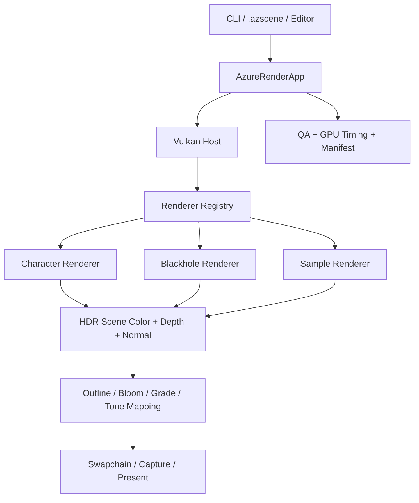

# AzureRender

AzureRender 提供原生 Vulkan 渲染核心、Windows 编辑器与独立 Player。公开探索项目包含角色、相机、交互和完整任务。资产、物理、Lua、动画、声音与游戏界面由引擎运行时管理。

首次使用请阅读 [构建与使用](getting-started.md)。制作关卡请阅读 [编辑器操作指南](runtime/editor-game-ui.md)。运行和交付见 [探索关卡](runtime/exploration-gameplay.md)与[游戏发布](runtime/game-publishing.md)。

## 能力总览

| 层级 | 当前实现 |
| --- | --- |
| Vulkan 宿主 | Instance、Validation、设备与 Queue、Swapchain、Render Pass、Pipeline、Descriptor、同步、查询池、资源销毁 |
| 场景扩展 | `ISceneRenderer` 生命周期、能力声明、Registry、Shader Feature Catalog |
| 公共图像管线 | HDR Scene Color、Depth、Normal、阴影贴图、Bloom、描边、Tone Mapping、最终 Present |
| Character | glTF、蒙皮动画、材质分类、Toon Ramp、Face SDF、Hair KK/AO、PCSS、眉毛 Overlay |
| Blackhole | 光线积分、吸积盘噪声、多普勒、Beaming、引力红移、双 History TAA |
| 工具 | 编辑器、命令行 QA、确定性 PNG、GPU Timing JSON、图像比较、发布门禁 |
| 游戏运行时 | UUID 资产、版本化关卡、Prefab、Jolt 物理、Lua 脚本与独立 Player |
| 游戏表现与发布 | RmlUi、动画状态机、miniaudio、公开游戏模板与 Windows 游戏包 |

## 开发路线

当前阶段入口为 [开发总计划](plans/azure-engine-plan.md)。F1 至 P1、F3 和 R6 已完成，G7 为 Active。[角色与可玩关卡计划](plans/third-person-playable-plan.md)定义外观、动画、3C、玩法和工程验收。

## 原生 Vulkan 的边界

AzureRender 直接调用 Vulkan API 来管理资源和每一帧的执行。项目不依赖 Unreal、Unity、bgfx 或其他渲染框架。GLFW 只创建窗口和 Surface。Dear ImGui 提供编辑器控件。

tinygltf 和 stb 解析资产，nlohmann/json 读取数据文件。Shader 使用 GLSL 编写，再由 Vulkan SDK 的 `glslc` 编译为 SPIR-V。

因此，“原生 Vulkan 自研”描述的是渲染后端、场景架构和算法实现，而不是声称项目没有任何第三方依赖。

## 系统概览

宿主一次只运行一个 Scene Renderer。新场景通过 Registry 注册，不需要修改主帧循环。场景从只读 `RenderContext` 取得宿主提供的 Vulkan 对象。它只释放自己创建的资源。

## 两个场景

### 风格化角色

角色路径不直接套用统一的 PBR 材质。材质分类决定 Ramp、AO、镜面和轮廓。Face SDF 控制脸部阴影形状。

Hair HN/P 提供发束法线和双层 Kajiya-Kay 高光。2048 阴影贴图配合 PCSS 生成软阴影。

[阅读角色渲染原理](character-rendering.md)

### 黑洞模拟

黑洞路径在 Fragment Shader 中积分光线路径。射线会采样程序化吸积盘和环境背景。吸积盘包含旋转体密度、周期噪声和稀疏结构。

多普勒频移、相对论增亮和引力红移让盘面两侧呈现明显差异。双 History 时间累积负责稳定采样噪声。

[阅读黑洞模拟原理](blackhole-rendering.md)

## 阅读路线

引擎化开发：

1. [Azure Engine 开发总计划](plans/azure-engine-plan.md)
2. [开发与运行时文档规范](documentation-standard.md)
3. [运行时渲染图](runtime/render-graph.md)
4. [脚本与玩法](runtime/scripts-gameplay.md)

第一次运行项目：

1. [构建与使用](getting-started.md)
2. [资产、场景与编辑器](assets-and-editor.md)
3. [参数与接口参考](reference.md)

理解实现：

1. [渲染器架构与 Vulkan 实现](architecture.md)
2. [风格化角色渲染](character-rendering.md)
3. [黑洞模拟](blackhole-rendering.md)

继续开发或准备发布：

1. [开发、测试与发布](development-and-release.md)
2. [参数与接口参考](reference.md)

## 当前状态与边界

- Character 和 Blackhole 均可通过同一可执行文件运行，并支持确定性捕获。
- Renderer SDK 当前是进程内 C++ 接口，不承诺跨 DLL 的二进制 ABI。
- `.azscene` 当前 Schema 为 v2，`RenderSettings` 当前 Schema 为 v8。
- 黑洞是视觉导向的 Schwarzschild 近似模拟，不是科研级广义相对论求解器。
- 私有角色用于本机美术验收，公共 CI 和作品集必须使用可再分发资产。
- Android、动态插件 ABI 和完整资产生产管线不属于 `0.1.0-rc1` 的发布承诺。

文档只描述当前可验证实现。历史阶段计划、旧验收记录和源 DOCX 保留在仓库归档或 Git 历史中，不作为当前接口依据。
