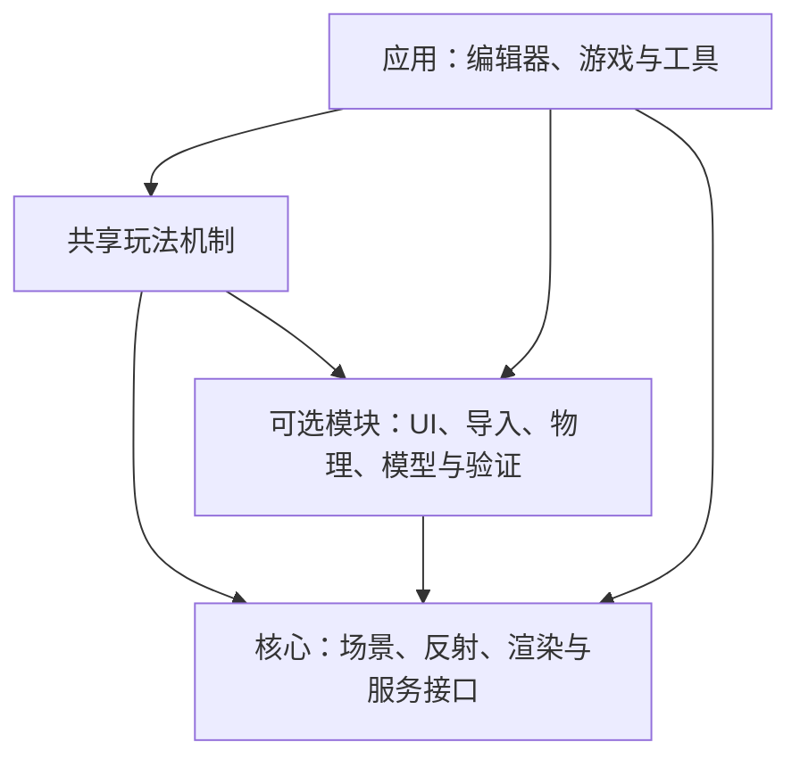

# gkNextEngine 架构借鉴评估

> 文档类型：技术调研与可行性评估
> 状态：检索完成，全部借鉴项已采纳为实施计划
> 更新日期：2026-10-06
> 适用范围：AzureRender 引擎、编辑器与开发工具

## 结论与检索范围

优先借鉴可配置的内容契约、单向依赖和自动验证闭环。这些设计直接服务引擎的通用性、扩展性和组合性。UI 借鉴重点是组件体系与职责划分。

AI 原生（AI Native）在本文中包含三个层面。协作层提供局部可理解的代码与文本资产。验证层提供查询、回放、截图和机器断言。产品层通过可选模块调用模型并验证领域产物。

接入形式按使用环境选择。命令行、进程协议或 MCP 都应调用统一能力契约。借鉴重点是能力发现、操作边界与结果验证。作者对接入方式的偏好作为观点处理。

参考仓库为 `D:/Project/gkNextEngine`。检索基线为 `4ba5b7cd106c282e7ed166ff853aeea87b392680`。当前项目基线为 `fe9afda68e30539fd61048ba23d19b90217d81ce`。两仓库在检索开始时工作树均干净。

检索覆盖构建、运行时接口、反射、编辑器和 UI 基础。还检查了模型协议、内容适配器、验证脚本与测试源码。`D:/Assigment/temp.txt` 提供作者文章和检索线索。事实判断以本地提交的源码为准。

本文完成静态源码审阅。参考引擎的构建、交互体验和性能尚未实测。测试文件说明其验证设计，实际通过状态需运行确认。来源路径、行号和哈希见[检索清单](gknextengine-source-map.json)。

参考仓库的主要依赖关系如下。箭头表示上层使用下层。共享机制按其用途选择可选模块。gnb 在独立进程中编排构建与验证。

## 分级依据

分级依次考虑边界价值、跨场景复用、现有契合度和验证成本。功能数量与画面复杂度作为辅助信息。

| 级别 | 判断依据 | 采用方式 |
| --- | --- | --- |
| A 核心必借鉴 | 直接决定职责、契约和可验证性 | 优先纳入设计约束，按受影响模块实施 |
| B 强烈推荐 | 显著改善编辑体验和开发效率 | 随对应模块建设进入实施计划 |
| C 可选参考 | 需要专项需求或较大的技术迁移 | 先做独立原型与收益验证 |

成本为一名熟悉项目开发者的粗略工作量。S 约 1 至 3 人日，M 约 4 至 10 人日。L 约 11 至 25 人日，XL 超过 25 人日。估算包含局部实现和回归，不构成交付承诺。

| 编号 | 借鉴点 | 契合度 | 成本 | 主要风险 |
| --- | --- | --- | --- | --- |
| A1 | 单向依赖与显式模块装配 | 高 | M | 生命周期和依赖泄漏 |
| A2 | 属性元数据与统一类型契约 | 高 | M | 版本、字段和权限漂移 |
| A3 | 编辑命令、撤销与统一执行入口 | 高 | L | 行为变化和部分写入 |
| A4 | 状态查询、条件等待和自动验证 | 高 | M 至 L | 测试替身与实际路径偏离 |
| A5 | 文本内容与可追踪的资产生成 | 高 | M | 依赖失效和内容版本 |
| A6 | 有界 AI 提案与领域验证 | 高 | M 至 L | 过期结果和不合法产物 |
| B1 | UI 语义样式与基础组件 | 高 | M | DPI、状态和样式栈 |
| B2 | 编辑器上下文、面板和动作划分 | 高 | M | 上下文膨胀和输入焦点 |
| B3 | 类型化控制变量与配置来源 | 高 | M | 优先级、线程与持久化 |
| B4 | 模型接入的独立进程与协议 | 中高 | L | 协议、取消和服务可用性 |
| B5 | 可组合的构建与验证命令行 | 高 | M | 配置漂移和工具膨胀 |
| B6 | 热重载的接口与模块边界 | 高 | M 至 L | 在途资源和失败恢复 |
| B7 | 离屏视图、缩略图与按需更新 | 中高 | L | 多视图资源和同步 |
| B8 | 共享机制与应用玩法的分层 | 高 | L | 既有关卡兼容 |
| C1 | 程序化几何与文本骨骼动画 | 中 | XL | 语言语义、几何质量和缓存 |
| C2 | Slang 模块与着色算法组合 | 中 | L 至 XL | 工具链、布局和性能回归 |
| C3 | Bindless 与 GPU 驱动可见性 | 中 | XL | 设备契约、同步和拾取 |
| C4 | 可替换脚本后端与生成绑定 | 中 | XL | ABI、跨平台和热重载 |

## A 核心必借鉴

### A1 单向依赖与显式模块装配

源码入口：[TargetHelpers.cmake](https://github.com/gameknife/gkNextEngine/blob/4ba5b7cd106c282e7ed166ff853aeea87b392680/src/cmake/TargetHelpers.cmake#L178)、[SceneContent.hpp](https://github.com/gameknife/gkNextEngine/blob/4ba5b7cd106c282e7ed166ff853aeea87b392680/src/Engine/Runtime/Interface/SceneContent.hpp#L10)。

**是什么与在哪里：** 核心定义服务接口，模块提供实现。应用显式链接所需模块。见 `src/cmake/TargetHelpers.cmake` 的 `gk_configure_module`。再看 `SceneContent.hpp` 和 `LiveCodingModule.cpp` 的安装入口。

**为什么：** 内容导入、调试和模型服务可分别替换。一个新工具可以选择自己的依赖组合。核心生命周期具有明确的服务所有权。

**可行性：** 当前已有 Foundation、Platform、RenderCore、Runtime 和 Editor 库。也有版本化的 `ExtensionRegistry`。适合沿现有接口补齐装配和关闭契约，成本 M。主要风险是重复安装、销毁顺序与公共头文件泄漏。

**建议验收：** 最小 Player 与编辑器分别构建。可选模块关闭时，核心仍能运行。依赖方向进入自动检查。参考仓库的 CMake 装配有实现，完整头文件边界门禁需单独设计。

### A2 属性元数据与统一类型契约

源码入口：[PropertyMeta.hpp](https://github.com/gameknife/gkNextEngine/blob/4ba5b7cd106c282e7ed166ff853aeea87b392680/src/Engine/Runtime/Reflection/PropertyMeta.hpp#L39)、[PropertyWidgets.cpp](https://github.com/gameknife/gkNextEngine/blob/4ba5b7cd106c282e7ed166ff853aeea87b392680/src/Application/Editor/gkNextEditor/Panels/PropertyWidgets.cpp#L237)。

**是什么与在哪里：** 属性声明包含类别、提示、范围和访问标记。编辑器按元数据绘制字段。见 `Runtime/Reflection/PropertyMeta.hpp` 和 `Panels/PropertyWidgets.cpp`。

**为什么：** 组件新增字段时，类型、编辑和校验职责清楚。AI 工具可以发现合法字段与范围。实体存储、属性访问和文件格式具有可审查边界。

**可行性：** 当前 `reflection/Registry.hpp` 已有版本、范围和迁移。适合扩充分类、只读和暴露权限，成本 M。主要风险是同一字段在 UI、脚本和序列化中产生不同规则。

**建议验收：** 一个新增组件通过注册进入属性面板和加载器。非法类型与越界值得到一致诊断。机器可读模式由当前元数据派生。这是 AzureRender 的候选扩展，参考仓库的 AI 适配器另有领域模式。

### A3 编辑命令、撤销与统一执行入口

源码入口：[ICommand.hpp](https://github.com/gameknife/gkNextEngine/blob/4ba5b7cd106c282e7ed166ff853aeea87b392680/src/Engine/Runtime/Command/ICommand.hpp#L11)、[CommandHistory.hpp](https://github.com/gameknife/gkNextEngine/blob/4ba5b7cd106c282e7ed166ff853aeea87b392680/src/Engine/Runtime/Command/CommandHistory.hpp#L100)。

**是什么与在哪里：** `ICommand` 定义执行、撤销与合并。`CommandHistory` 管理历史与命令分组。`EditorActionDispatcher` 分发应用动作。`EditorScriptExecutor` 将文本操作接入编辑功能。

**为什么：** 菜单、快捷键和自动工具可以共享编辑语义。连续拖动可合并为一个撤销单元。工具报告能够关联具体操作与错误。

**可行性：** 当前 `EditorSession` 提供会话命令。`EditorContext` 用快照维护撤销。`EditorAutomation` 另有操作分派。适合统一为类型化编辑操作，成本 L。

**风险与验收：** 命令分组本身不能证明原子回滚。需验证批量操作中途失败时的恢复。UI 与自动入口必须产生相同文档结果。重做、保存重开和 Play/Stop 均须回归。

### A4 状态查询、条件等待和自动验证

源码入口：[AgentQueries.hpp](https://github.com/gameknife/gkNextEngine/blob/4ba5b7cd106c282e7ed166ff853aeea87b392680/src/Engine/Runtime/Interface/AgentQueries.hpp#L11)、[validate.go](https://github.com/gameknife/gkNextEngine/blob/4ba5b7cd106c282e7ed166ff853aeea87b392680/tools/gnb/internal/validate/validate.go#L54)。

**是什么与在哪里：** 核心定义 `FAgentQueryRegistry` 和控制服务接口。`NextValidation` 注入应用事件并处理查询。`tools/gnb/internal/validate/validate.go` 编排等待、断言和报告。实例见 `assets/agentscripts/`。

**为什么：** AI 可以观察运行状态并证明操作结果。条件等待表达资源加载与场景提交的真实完成点。结构化报告便于定位失败阶段。

**可行性：** 当前已有编辑命令回放、游戏输入回放和截图证据。适合补查询命名空间、条件等待和统一报告，成本 M 至 L。需保留生产命令与 UI 输入两类路径的独立验收。

**风险与验收：** 自动模式的渲染设置可能影响真实表现。参考验证模式明确改变窗口和 Streamline 行为。采用时记录设备、输入、源码和测试模式。查询错误、等待超时和断言失败须返回非零状态。

控制通道由工具端使用随机令牌和本机回环地址。服务端按传入地址绑定，校验请求令牌。AzureRender 若采用该设计，需在服务端约束回环地址。该限制属于候选契约。

### A5 文本内容与可追踪的资产生成

源码入口：[FScadEvaluator.h](https://github.com/gameknife/gkNextEngine/blob/4ba5b7cd106c282e7ed166ff853aeea87b392680/src/Modules/ScadLoader/FScadEvaluator.h#L32)、[FScadRig.h](https://github.com/gameknife/gkNextEngine/blob/4ba5b7cd106c282e7ed166ff853aeea87b392680/src/Modules/ScadLoader/FScadRig.h#L27)。

**是什么与在哪里：** SCAD 表达参数化几何和模块组合。ScadRig 表达骨骼与关键帧。见 `ScadLoader/FScadEvaluator.h`、`FScadRig.h` 和 `assets/scad/`。

**为什么：** AI 能检查局部内容并生成可审阅修改。参数、来源和依赖支持重建与复用。内容生产具有加载、预览和验证闭环。

**可行性：** 当前已有项目、关卡、Prefab、动画图和 Lua 文本。`AssetDatabase` 已记录内容哈希、依赖与缓存。优先完善现有文本契约，成本 M。几何解析器属于 C1 的独立选项。

**风险与验收：** 二进制美术资产通过导入接口管理。生成器需声明输入、版本、依赖和输出。两份不同项目应能使用同一生成器。移动目录、依赖变化和失败重建须可验证。

### A6 有界 AI 提案与领域验证

源码入口：[ScadAIContracts.hpp](https://github.com/gameknife/gkNextEngine/blob/4ba5b7cd106c282e7ed166ff853aeea87b392680/src/Application/Editor/ScadLibrary/AI/ScadAIContracts.hpp#L41)、[ScadAIValidationPolicy.hpp](https://github.com/gameknife/gkNextEngine/blob/4ba5b7cd106c282e7ed166ff853aeea87b392680/src/Application/Editor/ScadLibrary/AI/ScadAIValidationPolicy.hpp#L7)。

**是什么与在哪里：** `ScadAIContracts` 定义目标、基础版本和提案状态。`ScadAIController` 负责生成、校验、取消与有限修复。`ScadAIValidationPolicy` 限定产物与历史规模。领域适配器生成候选结果。

**为什么：** 模型输出具有明确的应用边界。文档在生成期间被修改时，基础版本可识别过期提案。校验失败能产生诊断与有限重试。

**可行性：** 该设计适用于未来资产或场景辅助编辑。先统一 A2、A3，再引入候选结果，成本 M 至 L。当前项目尚无等价的模型提案服务。该约束在任何 AI 写入功能中必须满足。

**风险与验收：** 本地校验负责字段、引用、有限数值与领域语义。必须覆盖过期结果、取消、非法引用和修复耗尽。使用固定响应夹具回归。真实模型质量另做人工和实机验证。

`Test_ScadAIController.cpp` 覆盖过期、取消和一次修复。`Test_ScadAIAdapters.cpp` 覆盖稳定 ID 与领域限制。借鉴的是控制与验证边界，领域规则由对应应用持有。

## B 强烈推荐

### B1 UI 语义样式与基础组件

源码入口：[UiTheme.hpp](https://github.com/gameknife/gkNextEngine/blob/4ba5b7cd106c282e7ed166ff853aeea87b392680/src/Modules/NextUI/UI/UiTheme.hpp#L1)、[UiWidgets.hpp](https://github.com/gameknife/gkNextEngine/blob/4ba5b7cd106c282e7ed166ff853aeea87b392680/src/Modules/NextUI/UI/UiWidgets.hpp#L26)。

**是什么与在哪里：** `NextUI/UI` 包含主题、尺度、作用域和控件。颜色用 `EColor` 表达表面、强调和状态。按钮声明变体、选中、禁用与提示。`AppChrome` 负责应用外框和操作结果。

**为什么：** 深色中性表面突出场景和选中状态。共享尺度让工具栏、属性区和底栏保持一致。作用域对象维护 ImGui 样式与 ID 栈。

**可行性：** 当前已用 Dear ImGui、中文字体、DPI 和 sRGB UI。`EditorTheme` 可提炼为语义样式和组件库，成本 M。保留项目的工作区结构与字体资源。

**风险与验收：** 需验证窄窗口、不同 DPI、文字焦点和禁用状态。截图验证布局，事件回放验证控件行为。参考基础层仍包含 ImGui 类型，采用范围为编辑器 UI。它不是跨 UI 后端的完整抽象。

### B2 编辑器上下文、面板和动作划分

源码入口：[EditorContext.hpp](https://github.com/gameknife/gkNextEngine/blob/4ba5b7cd106c282e7ed166ff853aeea87b392680/src/Application/Editor/gkNextEditor/EditorContext.hpp#L6)、[EditorUi.hpp](https://github.com/gameknife/gkNextEngine/blob/4ba5b7cd106c282e7ed166ff853aeea87b392680/src/Application/Editor/gkNextEditor/EditorUi.hpp#L1)。

**是什么与在哪里：** `EditorContext` 显式提供场景、动作和设置。`EditorUi` 声明面板与视口覆盖层。`Core/EditorUiState` 存储界面状态。标题栏和具体面板拥有独立源码入口。

**为什么：** 面板组织、显示状态和场景修改各有职责。任务的认知范围可以限制在单个面板或动作。层级、属性和内容浏览器共享当前选择。

**可行性：** 当前已有工作区、面板接口和会话上下文。适合细化只读视图和编辑服务，成本 M。面板应通过 A3 的操作入口修改文档。

**风险与验收：** 上下文若暴露全部服务会再次扩大耦合。验证新增面板的注册、关闭、重开和布局恢复。键盘焦点、拖放、拾取与视口坐标也需回归。

### B3 类型化控制变量与配置来源

源码入口：[CVarSystem.hpp](https://github.com/gameknife/gkNextEngine/blob/4ba5b7cd106c282e7ed166ff853aeea87b392680/src/Engine/Runtime/Config/CVarSystem.hpp#L49)。

**是什么与在哪里：** `CVarSystem.hpp` 声明类型、范围与访问标记。来源包括默认文件、用户文件、命令行和控制台。`CVarEditorPanel` 提供统一编辑入口。

**为什么：** 渲染和诊断参数可查询、搜索和验证。默认值、运行值和持久化职责清楚。自动工具可发现参数合法范围。

**可行性：** 当前已有 `RenderSettings`、项目配置与命令行。适合引入设置注册表并保持现有文件契约，成本 M。玩法数值由组件或项目配置拥有。

**风险与验收：** 需明确覆盖优先级与帧边界生效时机。启动专用值和只读值必须校验。用户设置保存重开、错误值拒绝与发布默认值均需测试。

### B4 模型接入的独立进程与协议

源码入口：[AIService.hpp](https://github.com/gameknife/gkNextEngine/blob/4ba5b7cd106c282e7ed166ff853aeea87b392680/src/Modules/NextAI/AIService.hpp#L12)、[bridge.go](https://github.com/gameknife/gkNextEngine/blob/4ba5b7cd106c282e7ed166ff853aeea87b392680/tools/gnb/internal/ai/bridge/bridge.go#L47)。

**是什么与在哪里：** `NextAI/AIService` 提供模型请求接口。`GnbAIClient` 通过子进程通信。Go bridge 使用 NDJSON 和 JSON-RPC 2.0。provider、会话与模型配置位于 `tools/gnb/internal/ai/`。

**为什么：** 凭据、网络和模型服务独立于渲染核心。接入层可替换，应用持有自己的提示、模式和回退。通用服务能够保持较小认知范围。

**可行性：** 当前 C++17、Lua 与 Python 工具可承接相同边界。候选实现可沿既有语言选型，成本 L。引入 Go 或完整 Dashboard 需独立理由。

**风险与验收：** 协议需版本、期限、取消和结构化输出状态。Go 与 C++ 共享协议夹具值得借鉴。服务缺失、进程退出和非法响应须有确定结果。运行测试使用固定响应，真实调用单独验证。

当前 `NextAI` 是轻量模型客户端。编辑器脚本控制台是显式编辑入口。本文未在所检索接口中发现通用模型工具注册表。AI 验证通道、游戏寻路 AI 和模型服务具有各自职责。

### B5 可组合的构建与验证命令行

源码入口：[README.md](https://github.com/gameknife/gkNextEngine/blob/4ba5b7cd106c282e7ed166ff853aeea87b392680/tools/gnb/README.md#L1)。

**是什么与在哪里：** gnb 编排 setup、build、run、test 和 doctor。shot 与 validate 复用运行和报告机制。见 `tools/gnb/README.md` 与 `internal/validate/validate.go`。

**为什么：** 人与 AI 使用同一套可发现入口。目标、配置和失败状态保持一致。构建与验收工具可组合进入持续集成。

**可行性：** 当前已有配置、打包、来源校验和性能脚本。适合增加薄命令入口，复用既有实现，成本 M。运行时 API 与开发工具保持独立。

**风险与验收：** 工具需控制功能边界与并发构建。验证受影响目标选择、退出码和参数转发。安装目录和含空格路径作为正式用例。

### B6 热重载的接口与模块边界

源码入口：[ShaderHotReload.hpp](https://github.com/gameknife/gkNextEngine/blob/4ba5b7cd106c282e7ed166ff853aeea87b392680/src/Engine/Runtime/Interface/ShaderHotReload.hpp#L5)、[LiveCodingModule.cpp](https://github.com/gameknife/gkNextEngine/blob/4ba5b7cd106c282e7ed166ff853aeea87b392680/src/Modules/LiveCoding/LiveCodingModule.cpp#L1)。

**是什么与在哪里：** `IShaderHotReloader` 定义更新和状态接口。`LiveCodingModule` 安装具体实现。文件监听与编译逻辑由模块拥有。

**为什么：** 开发期服务可按需启用。渲染宿主通过明确时机接收重建请求。编译失败与运行状态具有独立诊断。

**可行性：** 当前已有资产刷新和脚本重载。适合先规范资源更新事务，再评估着色器重载，成本 M 至 L。完整 C++ 热编译属于进一步选项。

**风险与验收：** GPU 在途资源必须等待安全替换。编译失败保持当前有效资源。依赖变更、重复请求、取消与退出释放须测试。

### B7 离屏视图、缩略图与按需更新

源码入口：[OffscreenRenderViewController.hpp](https://github.com/gameknife/gkNextEngine/blob/4ba5b7cd106c282e7ed166ff853aeea87b392680/src/Modules/RenderViews/OffscreenRenderViewController.hpp#L20)、[AssetThumbnailRenderer.hpp](https://github.com/gameknife/gkNextEngine/blob/4ba5b7cd106c282e7ed166ff853aeea87b392680/src/Application/Editor/Common/Preview/AssetThumbnailRenderer.hpp#L19)。

**是什么与在哪里：** `OffscreenRenderViewController` 实现视图服务。它声明相机覆盖、尺寸、按帧请求与资源失效入口。`AssetThumbnailRenderer` 将该能力用于资产预览。

**为什么：** 内容浏览器、相机预览和截图可共享视图基础。按需更新控制编辑器的额外渲染成本。预览资源生命周期具有专门边界。

**可行性：** 当前已有离屏编辑视口和捕获。扩展为独立视图句柄与调度服务，成本 L。先验证单个资产预览，再扩展多视口。

**风险与验收：** 多视图需要独立相机、历史和尺寸状态。参考实现有固定视图上限，需按本项目预算设计。尺寸切换、场景卸载和预览释放必须通过显存检查。

### B8 共享机制与应用玩法的分层

源码入口：[CMakeLists.txt](https://github.com/gameknife/gkNextEngine/blob/4ba5b7cd106c282e7ed166ff853aeea87b392680/src/Gameplay/CMakeLists.txt#L1)。

**是什么与在哪里：** `NextGameplay` 独立于 `gkNextEngine`。角色、导航和 AI 机制位于 `src/Gameplay/`。具体游戏入口位于 `src/Application/Game/`。

**为什么：** 引擎提供实体、资源和运行调度。共享机制可供不同应用组合。具体任务、胜负与关卡内容由应用拥有。

**可行性：** 当前 `GameRuntime` 组合物理、输入、第三人称和交互。可按接口拆出共享机制，并保留现有关卡兼容，成本 L。新增相机或控制方式应通过装配进入运行循环。

**风险与验收：** 参考 `NextGameplay` 可链接 ScadLoader 和 NextAI。应逐项审查这些依赖的必要性。验证探索关卡与一种非探索工作流。二者共享核心，应用差异通过配置或模块表达。

## C 可选参考

### C1 程序化几何与文本骨骼动画

源码入口：[FScadCsg.cpp](https://github.com/gameknife/gkNextEngine/blob/4ba5b7cd106c282e7ed166ff853aeea87b392680/src/Modules/ScadLoader/FScadCsg.cpp#L20)、[FScadRig.h](https://github.com/gameknife/gkNextEngine/blob/4ba5b7cd106c282e7ed166ff853aeea87b392680/src/Modules/ScadLoader/FScadRig.h#L27)。

**是什么与在哪里：** ScadLoader 解析和求值 SCAD。`FScadCsg.cpp` 接入条件启用的 Manifold。ScadRig 从约定的骨骼模块和动画变量生成刚体绑定资产。

**为什么：** 参数化建筑、道具和原型角色容易复用与审阅。几何生成与动作来源可以进入同一内容工作流。

**可行性：** 适合有程序化原型需求时采用，契合度中、成本 XL。先验证单一生成器并接入现有导入接口。完整语言解析器需要独立范围。

**风险与验收：** ScadRig 的刚体部件与蒙皮美术资产有不同契约。SCAD 语义、坐标系、布尔运算和复杂度需限制。`FScadEvaluator.h` 的部分头部说明需与实现逐项核对。语言兼容性须由测试证明。

### C2 Slang 模块与着色算法组合

源码入口：[Interfaces.slang](https://github.com/gameknife/gkNextEngine/blob/4ba5b7cd106c282e7ed166ff853aeea87b392680/assets/shaders/common/Interfaces.slang#L53)、[PathTracingRenderer.slang](https://github.com/gameknife/gkNextEngine/blob/4ba5b7cd106c282e7ed166ff853aeea87b392680/assets/shaders/common/PathTracingRenderer.slang#L13)。

**是什么与在哪里：** `common/Interfaces.slang` 定义着色接口。`RayTracers.slang` 提供不同追踪策略。`PathTracingRenderer.slang` 组合追踪、直接光照和缓存。入口文件声明具体策略与调度。

**为什么：** 光照算法与具体追踪实现具有组合边界。共享算法能被多个管线调用。材质和计算路径可局部推理。

**可行性：** 当前使用 GLSL 和 Vulkan 1.3。先做一个等价 Pass 原型，契合度中、成本 L 至 XL。类型共享与模块组织可先在现有语言内完善。

**风险与验收：** 需验证 SPIR-V、内存布局、编译时间与设备覆盖。逐张比较输出并跑相同预算。作者文章中的帧率观察缺少严格 A/B。本文未将其作为性能收益依据。

### C3 Bindless 与 GPU 驱动可见性

源码入口：[VulkanBaseRenderer.cpp](https://github.com/gameknife/gkNextEngine/blob/4ba5b7cd106c282e7ed166ff853aeea87b392680/src/Engine/Rendering/VulkanBaseRenderer.cpp#L337)、[Texture.hpp](https://github.com/gameknife/gkNextEngine/blob/4ba5b7cd106c282e7ed166ff853aeea87b392680/src/Engine/Assets/GPU/Texture.hpp#L48)。

**是什么与在哪里：** GPUScene 使用地址与索引定位场景资源。Bindless 管理纹理访问。Visibility Buffer 表达可见表面。见 `BasicTypes.slang`、`BindlessTexture.slang` 和 `VisibilityBufferLayout.hpp`。

**为什么：** 可减少大量实例的 CPU 提交与资源接线。可见性、表面重建和材质着色具有独立数据契约。适合经测量确认的大场景瓶颈。

**可行性：** 当前已有帧图、裁剪验收与并行提交。完整迁移契合度中、成本 XL。先用独立基准验证目标实例规模和收益。

**风险与验收：** 需要设备能力、资源生命周期与同步设计。镜像、透明、蒙皮、阴影和拾取都须覆盖。当前参考源码包含能力探测与 Compatibility 路径。设备契约按实际实现评估。

既有 Intel 核显和 RTX 验收范围必须保持。Bindless 的资源定位方式仍要求正确的内存屏障。纯粹的格式或 API 迁移需要收益证据。

### C4 可替换脚本后端与生成绑定

源码入口：[ScriptRuntime.hpp](https://github.com/gameknife/gkNextEngine/blob/4ba5b7cd106c282e7ed166ff853aeea87b392680/src/Engine/Runtime/Interface/ScriptRuntime.hpp#L7)、[EngineApi.def.h](https://github.com/gameknife/gkNextEngine/blob/4ba5b7cd106c282e7ed166ff853aeea87b392680/src/Modules/NextDotNet/EngineApi.def.h#L1)。

**是什么与在哪里：** 核心 `IScriptRuntime` 定义脚本服务入口。NextDotNet 提供模块安装与托管运行。`EngineApi.def.h` 描述绑定面。源码和设计提供 CoreCLR 与 NativeAOT 两种后端。

**为什么：** 脚本语言与引擎运行生命周期具有边界。生成绑定降低多个语言接口的维护漂移。应用选择自己的脚本装配。

**可行性：** 当前 Lua 已承担玩法与热重载。接口思想契合，新增 C# 后端成本 XL。先规范已有 Lua 服务生命周期，再按用户需求评估语言扩展。

**风险与验收：** 需处理对象句柄、异常、回调和绑定版本。托管热重载与 AOT 有不同能力范围。编辑器 Play 状态恢复也须独立验证。

参考 `EditorPlaySession.hpp` 明确以磁盘场景重载结束 Play。当前 AzureRender 验收包含编辑态恢复。采用脚本后端时必须保持本项目的恢复契约。

## 当前项目的边界检查

现有项目已具备项目文件、模块库、资源标识和独立 Player。ECS、反射、Lua、Prefab 和扩展注册表提供通用基础。后续工作应在这些基础上验证组合与替换能力。

以下项目来自源码审阅，属于架构改造候选。它们的运行影响仍需专项复现与设计验证。

| 位置 | 已观察到的实现 | 引擎级边界建议 | 关联 |
| --- | --- | --- | --- |
| `runtime/ComponentCodec.hpp` | 固定类型分派决定可安装组件 | 类型注册同时提供编码、校验和安装能力 | A1、A2 |
| `runtime/InteractionRuntime.hpp` | 直接检查 Collectible 与 Door 状态 | 通用目标筛选调用应用策略或统一可用状态 | B8 |
| `runtime/GameRuntime.cpp` | 移动动作名与 walk/idle 选择进入运行循环 | 控制与动画驱动作为可配置系统装配 | A1、B8 |
| `runtime/InputActions.hpp` | 默认绑定包括交互和重开 | 默认值有配置归属，项目可替换动作集合 | B3、B8 |
| `editor/EditorAutomation.cpp` | 文本操作由长分派链执行 | 使用命令描述与统一执行器 | A3、A4 |
| `editor/EditorContext.cpp` | 历史保存文档快照 | 明确批量编辑、合并和版本契约 | A3、A6 |
| `editor/EditorTheme.cpp` | 颜色和尺度集中于主题函数 | 语义样式与可复用控件分层 | B1 |

固定标识在示例脚本和默认配置中可以有明确用途。判断重点是归属和替换方式。一个参数可以配置，并不自动证明其所在模块边界合理。

## 实施路线与计划入口

全部 18 项已纳入[主实施计划](../plans/2026-10-06-engine-evolution.md)。下表说明六组目标的依赖顺序。文件、接口与测试由三个子计划定义。[总计划](../plans/azure-engine-plan.md)维护阶段执行状态。

| 顺序 | 目标 | 借鉴项 | 进入下一步的证据 |
| --- | --- | --- | --- |
| 1 | 核心、机制和应用的职责地图 | A1、A2、B8 | 依赖图、组件注册扩展、两种工作流设计 |
| 2 | 统一编辑操作与文档版本 | A3、A6 | 同路径结果、失败恢复、撤销与过期拒绝 |
| 3 | 可发现的状态与自动闭环 | A4、A5、B5 | 查询、条件等待、输入回放与来源报告 |
| 4 | UI 基础与设置体系 | B1、B2、B3 | 多面板复用、DPI、焦点与设置回归 |
| 5 | 有界内容辅助生成 | A6、B4 | 固定响应、领域校验、预览与应用证据 |
| 6 | 开发资源服务与专项原型 | B6、B7、C1 至 C4 | 收益测量、兼容与资源门禁 |

每次实施需明确模块、数据契约和第二个使用场景。验证既有探索关卡，同时验证独立工具或其他玩法。新能力通过配置、组件、脚本或模块装配使用。

## 开发约束与来源

仓库根目录的 `AGENT.md` 定义实现准入。A1 至 A6 对应依赖、属性、命令、验证、内容和 AI 写入规则。B1、B2 与 B8 对应 UI、编辑器和玩法职责。

参考仓库根许可为 MIT。第三方库、字体和随附运行库按各自许可管理。实际引用代码时记录来源提交与文件，并保留许可声明。本文为架构分析，未导入参考仓库的源码或资产。

检索清单记录每个来源的完整本机路径和 SHA-256。公开源码链接固定到所检索提交。文章中的行数、游戏数量与性能观察按作者统计口径理解。当前采用判断以本次来源和项目约束为准。
