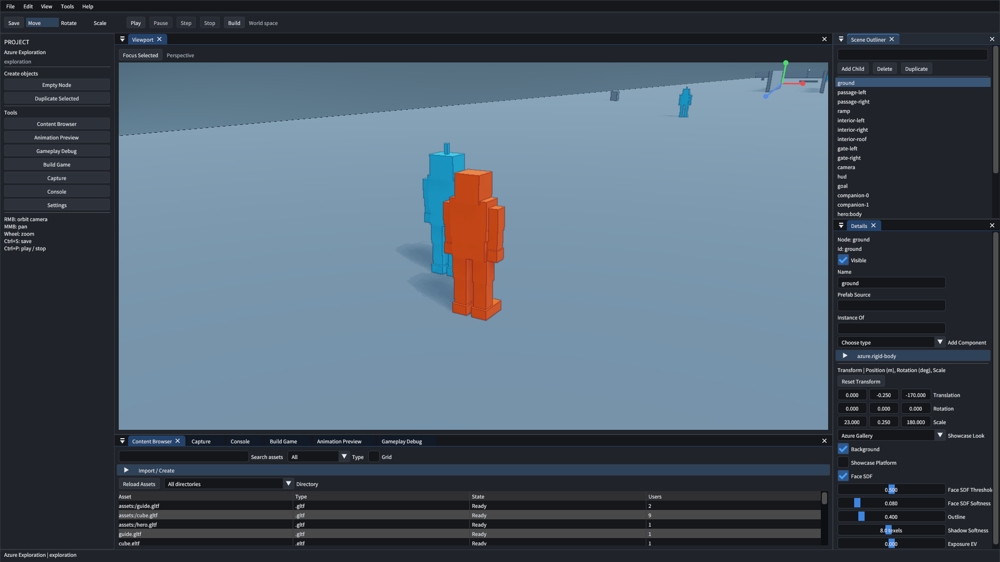

# 编辑器交互体验审查

> 文档类型：体验审查
> 日期：2026-10-07
> 基线：`5de3dcc`
> 范围：Windows 编辑器的常用制作流程
> 状态：审查完成，修复进入计划

## 审查方法与证据范围

审查覆盖导航、选择、变换、内容制作和运行预览。
同时检查保存安全、错误反馈与输入验收。
源码检查确认实现路径和缺失入口。
界面回放验证 Dear ImGui 的实际命中与操作。

本轮使用探索项目的独立副本。
实体键鼠和原生窗口事件尚未复核。
相机方向来自用户反馈与源码分析。
本文区分回放确认、源码确认和待实测问题。

回放确认表示已在编辑器中观察到结果。
源码确认表示实现能直接支持该判断。
待实测表示风险成立，但具体症状需复现。
待实测项通过诊断决定修复范围。

原始摘要见[回放摘要](editor-usability-evidence/2026-10-07/summary.json)。
输入、报告、截图和哈希随证据清单保存。
诊断中无效的选中操作另有记录。
有效复现使用独立项目和明确的选中身份。

## 优先级依据

| 等级 | 判定依据 |
| --- | --- |
| P0 | 常用操作方向错误、输入冲突、变换错误或保存安全风险 |
| P1 | 制作流程中反复出现的阻断、误操作和反馈缺失 |
| P2 | 提升可发现性、效率和复杂项目可用性的能力 |

优先级衡量使用影响和错误后果。
实施阶段按共享机制与依赖组织。
源码位置采用下文的 S1 至 S12 标识。
每项问题都有明确的修复阶段和验收结果。

## 问题清单

| 编号 | 等级 | 状态 | 现象与依据 | 目标行为 | 阶段 |
| --- | --- | --- | --- | --- | --- |
| UX01 | P0 | 用户反馈、源码确认 | 右键使用绕目标轨道，横向符号与常用观察习惯相反，S1 | 右移向右看，上移向上看，提供反转设置 | U5 |
| UX02 | P0 | 回放确认 | 大纲双击缺少定位入口，S2 | 单击只选择，双击及 F 显式定位 | U5 |
| UX03 | P0 | 回放及源码确认 | Scale 后按 W 仍改变缩放，E/R 无变换绑定，S3 | W/E/R 切换移动、旋转、缩放 | U5 |
| UX04 | P0 | 源码确认 | 相机与拖拽释放依赖图像悬停，S1 | 操作拥有捕获会话，跨面板释放可靠结束 | U5 |
| UX05 | P1 | 源码确认 | 编辑相机没有右键飞行和 WASD 移动，S1/S3 | 右键观察并支持 WASD、Q/E、Shift 导航 | U5 |
| UX06 | P0 | 源码确认 | 定位使用局部平移、固定高度和固定距离，S1 | 按世界包围盒、视场角与视口比例构图 | U5 |
| UX07 | P1 | 源码确认 | 相机距离固定限制在 0.25 至 50，S1 | 大场景和微小对象均有尺度适配导航 | U5 |
| UX08 | P0 | 源码确认 | 三种变换共用轴线和圆点，S1 | 箭头、旋转环和缩放端点清晰区分 | U6 |
| UX09 | P0 | 源码确认 | 轴线沿世界方向，修改却写入局部坐标，S4/S5 | 世界和局部坐标系各有正确的变换语义 | U6 |
| UX10 | P0 | 源码确认 | 多选后变换只修改当前对象，S5 | 多选组操作保持相对关系并形成一个撤销单元 | U6 |
| UX11 | P1 | 源码确认 | 操纵器缺少取消、平面移动和等比缩放，S1 | Esc 恢复拖拽起点，补齐常用手柄 | U6 |
| UX12 | P1 | 源码确认 | 操纵器缺少移动、旋转和缩放吸附，S1 | 吸附可配置，界面明确显示开关与步长 | U6 |
| UX13 | P1 | 源码确认 | 空白拾取保持选中，Ctrl 拾取也直接替换，S4 | 空白清选，Ctrl 增减选择，行为与大纲一致 | U6 |
| UX14 | P1 | 待实测 | 拾取使用原始顶点，动画形变命中需复核，S4 | 拾取与实际可见姿态一致，遮挡规则明确 | U6 |
| UX15 | P1 | 源码确认 | 大纲过滤分支忽略 Ctrl，多选反馈不完整，S2 | 过滤、树和视口共享选择规则 | U6 |
| UX16 | P1 | 源码确认 | 视口选中后没有展开父链与滚动定位，S2 | 大纲自动揭示选中对象并保留用户展开状态 | U6 |
| UX17 | P1 | 源码确认 | 复制只遍历显式选中项，父节点子树未纳入，S5 | 复制子树及内部引用，并保持外部引用 | U7 |
| UX18 | P2 | 源码确认 | 大纲没有拖拽重设父级入口，S2/S5 | 重设父级保持世界姿态，循环引用有反馈 | U7 |
| UX19 | P1 | 回放确认 | 创建 ID 使用节点总数，删除后会产生重复 ID，S6 | 默认创建始终分配唯一身份 | U5 |
| UX20 | P1 | 源码确认 | 导入轮询位于面板和折叠区内，S7 | 会话独立推进任务，面板只展示进度 | U7 |
| UX21 | P1 | 源码确认 | 资产拖入只传资源身份，放置位置为默认原点，S7/S5 | 按鼠标位置射线放置，并提供无命中回退 | U7 |
| UX22 | P1 | 截图确认 | 同一模型出现虚拟路径和文件名两个条目，S7 | 按资产身份统一列出，显示稳定名称和路径 | U7 |
| UX23 | P2 | 源码确认 | 类型筛选仅有模型、Lua 和 Prefab，S7 | 类型由注册描述提供，支持现有内容格式 | U7 |
| UX24 | P1 | 源码确认 | 属性面板用字段名硬编码资产类型，字符串缓冲固定，S8 | 引用元数据决定选择器，长文本安全编辑 | U7 |
| UX25 | P1 | 源码确认 | 面板提供添加组件，缺少删除与逐字段重置，S8 | 组件和字段支持明确的撤销及约束反馈 | U7 |
| UX26 | P1 | 源码确认 | Undo 恢复时恒设 dirty，回到保存点仍显示未保存，S9 | 未保存状态按保存检查点和内容计算 | U5 |
| UX27 | P0 | 源码确认 | 关闭直接保存，Reload 直接覆盖编辑态，S9/S10 | 保存、放弃、取消有明确选择，失败保留会话 | U5 |
| UX28 | P1 | 待实测 | Play/Stop 未见编辑相机状态恢复，S10 | Stop 恢复视角、选择及输入所有权 | U5 |
| UX29 | P0 | 源码确认、待实测 | 运行滚轮回调缺少焦点检查，关闭视口未统一清输入，S3/S10 | 面板滚动不驱动游戏，关闭视口释放全部输入 | U5 |
| UX30 | P1 | 源码确认 | 成功操作清空 lastError，后台预览可能抹去失败反馈，S7/S10 | 错误有独立寿命、来源与主动关闭入口 | U7 |
| UX31 | P1 | 源码确认 | 创建、导入和构建主要依赖手输路径，S7/S11 | 有路径选择、历史目录与明确的合法性反馈 | U7 |
| UX32 | P0 | 源码确认 | UI 回放缺少 E/R/F 和右中键，原生按键走另一入口，S3/S12 | 回放覆盖实际输入路由并区分原生事件证据 | U5/P4 |
| UX33 | P2 | 待实测 | 选中反馈、轴标签、遮挡手柄和小窗口密度需复核，S1/S8 | 选中对象、工具状态和禁用原因可直接辨认 | U6/U7 |

UX01 的符号修复需分别检查水平与垂直方向。
右键观察和绕目标旋转分别拥有导航模式。
UX03 的回放只证明 W 未切换。
E/R 的结论来自绑定源码检查。

当前工具栏可以切换三种变换模式。
三个模式拥有不同的数值操作分支。
“始终缩放”作为用户观察记录。
本轮证据确认的是快捷键缺失和外观同构。

UX22 的截图确认存在重复展示。
路径规范化和身份合并是优先调查方向。
精确的重复来源需结合资产记录复核。
UX14、UX28、UX33 按实测结果关闭或修复。

## 关键回放结果

大纲选择 `ground` 后，选中身份正确。
主角投影矩形仍为同一组坐标。
这说明选择操作没有移动相机。

工具栏切到 Scale 后注入 W，再拖动 X 轴。
X 缩放达到约 1.2104，位置保持零。
这确认 W 没有执行移动工具切换。

独立场景初始含二十一个节点。
创建 `node-21` 与 `node-22` 后删除前者。
再次创建因 `node-22` 身份冲突而失败。
场景保持二十二个节点。

截图中大纲选中了地面，视角仍面向角色。
内容浏览器同时展示文件名和虚拟路径条目。
截图用于确认界面现象，不作为性能测量。

## 源码依据

下表路径相对 `Project/AzureRender/`。

| 标识 | 位置与检查点 |
| --- | --- |
| S1 | `src/editor/ImGuiEditorLayer.cpp`的 `drawViewportPanel`，以及`src/editor/EditorCameraController.cpp`的 `apply` |
| S2 | `src/editor/panels/OutlinerPanel.cpp`的树、过滤与选择分支 |
| S3 | `src/app/AzureRenderApp.cpp`的 `keyCallback` 和 `scrollCallback` |
| S4 | `src/app/AzureRenderFrame.cpp`的 `updateGizmoScreenData` 和 `pickPrimitive` |
| S5 | `src/editor/commands/EditorOperations.cpp`、`src/editor/EditorProjectEditing.cpp`和`src/editor/EditorContext.cpp` |
| S6 | `src/editor/EditorWorkspaceUI.cpp`的 Empty Node 按钮 |
| S7 | `src/editor/panels/AssetBrowserPanel.cpp`的导入、合并、预览及放置 |
| S8 | `src/editor/panels/InspectorPanel.cpp`的引用选择与字段编辑 |
| S9 | `src/editor/EditorContext.cpp`的 `save`、`reload`、`restore` 和历史 |
| S10 | `src/editor/EditorSession.cpp`、`src/main.cpp`及宿主运行状态 |
| S11 | `src/editor/panels/BuildPanel.cpp`的路径与创建入口 |
| S12 | `src/editor/EditorWorkspaceUI.cpp`与`tools/test_editor_workspace.py` |

## 结论与实施入口

下一轮优先处理常用操作正确性和保存安全。
验收采用具体制作任务与生产输入路径。
现有接口回归继续保护文档事务和引擎边界。
专项步骤见[交互体验实施计划](../plans/2026-10-07-editor-usability.md)。
