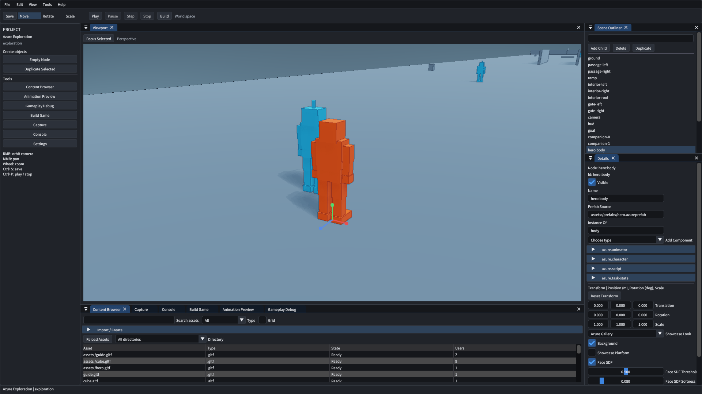
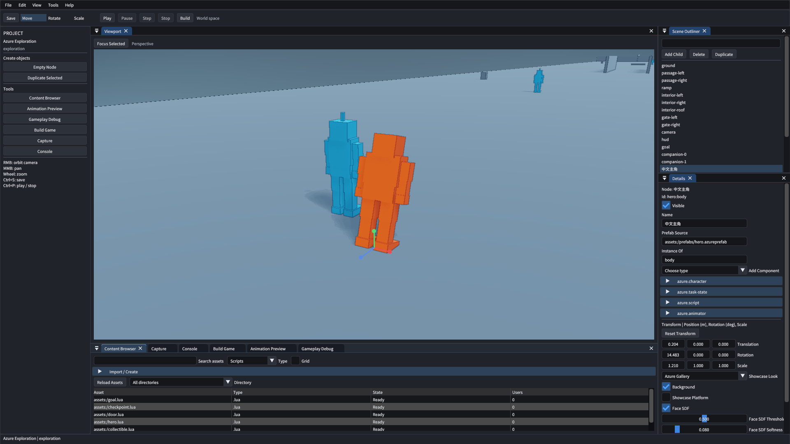
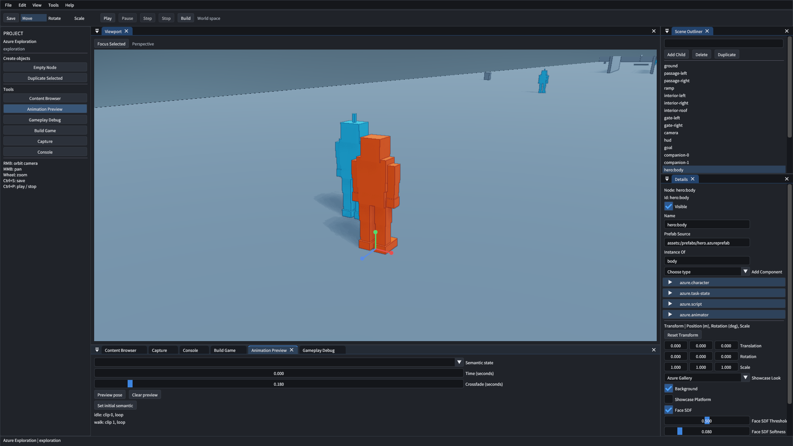
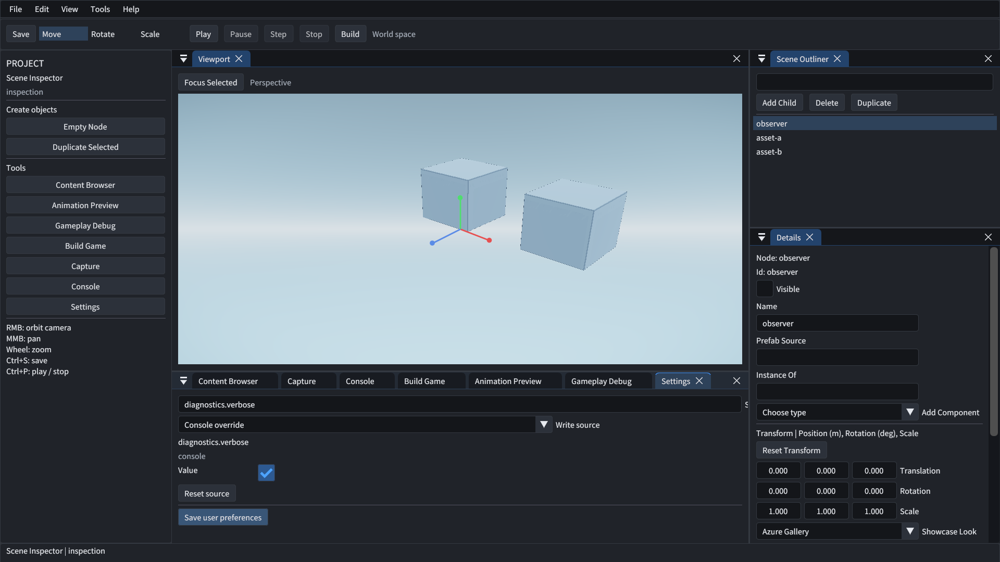
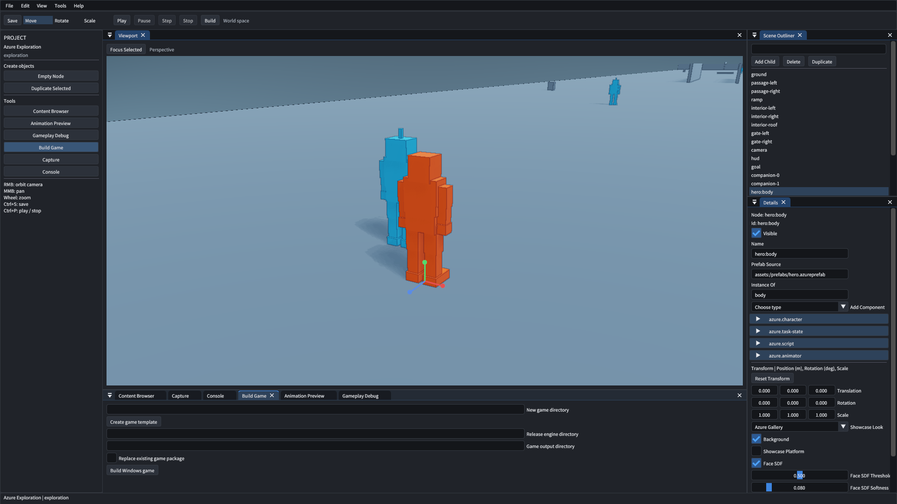

# 从空关卡制作并发布游戏

> 文档类型：使用教程
> 状态：生效
> 更新日期：2026-10-06
> 适用范围：Windows x64 编辑器、公开资源与独立 Player

## 准备环境与空项目

准备 Windows、Vulkan 驱动和 Release 引擎安装树。源码制作工具需要 Python 3.11+。构建方法见[构建复现说明](../runtime/build-reproducibility.md)。安装树包含字体、着色器、DLL 和许可。

在工程目录执行以下命令。输出目录应为空。工具创建空关卡，并准备公开脚本、动画图和 Prefab。

```powershell
python tools/create_editor_tutorial.py --output "D:/Games/My Exploration"
& "D:/AzureEngine/bin/AzureRender.exe" --editor-project "D:/Games/My Exploration/project.azureproject"
```

可观察结果是节点与模型资源数为零。Content Browser 显示制作资源。控制器、碰撞和动画通过后续步骤配置。

本页截图展示完成制作后的公开探索场景。空项目的 Outliner 在放置对象前显示空状态。



## 认识工作区

顶部工具栏提供 Save、Move、Rotate、Scale 和运行控制。右侧 Scene Outliner 选择对象，Details 编辑组件。底部 Content Browser 浏览资源。左侧 Tools 或顶部 View 菜单显示工具面板。

按住右键旋转相机，中键平移，滚轮缩放。Focus Selected 将镜头对准选中对象。操作柄端点可拖动，变换模式由工具栏选择。文本框内的按键由文本控件处理。


## 导入与放置公开模型

打开 Content Browser 的 Import / Create。填写公开资源的完整路径，点击 Import。依次导入 `assets_public/exploration/assets/hero.gltf`、`guide.gltf` 和 `cube.gltf`。

导入结果显示顶点、关节、材质和片段信息。资源行显示 Ready 后，双击模型或将其拖入视口。搜索与 Type、Directory 共同过滤记录。Scripts 和 Prefabs 显示对应资产。



## 配置角色、相机与碰撞

在 Import / Create 填写实例名 `hero`。从 Place Prefab 选择 `hero.azureprefab`。同样放置 `guide`、三个 `collectible`、`door` 和 `checkpoint`。实例名保持唯一。

在 Outliner 选中 `hero:body`。在 Details 的 Name 输入中文名，点击 Save。位置使用米，旋转使用角度，缩放使用倍率。Reset Transform 设置位置和旋转为零、缩放为一。

| 对象 | 入口与配置 | 可观察结果 |
| --- | --- | --- |
| 主角 | Character 的 `controlled=true`、`speed=2`、`sprintMultiplier=2.5`、`forwardYaw=180` | WASD 前向与动画一致，Shift 冲刺 |
| 相机空节点 | Add Component 选择 `azure.third-person-camera`，`target=hero:body` | 镜头跟随主角 |
| 地面立方体 | Position 为 `(0,-0.5,0)`，Scale 为 `(30,1,30)`，添加静态 RigidBody | 角色站在地面上 |
| 收集物 | Prefab 实例放在主角附近，调整 Interactable 的范围 | E 触发收集并更新任务 |
| HUD 空节点 | 添加 Game UI，`asset` 选择 `hud.rml` | 运行视口显示任务与操作 |

主角 Prefab 包含角色、动画、脚本和任务组件。语义动画的索引须与导入模型对应。碰撞形状、相机上下界和资源引用提交时校验。Console 记录无效配置，当前关卡保持有效。


## 预览动画与运行调试

从 Tools 打开 Animation Preview。选中主角，选择 `walk` 并设置时间，点击 Preview pose。Clear preview 恢复编辑姿态。Gameplay Debug 可显示碰撞、速度、落地状态与相机遮挡。

点击 Play，点入视口后使用 WASD、Shift、Space 和 E。Pause 暂停，Step 推进一次固定步，Resume 恢复。Stop 返回编辑内容。Esc 释放视口输入。



## 保存与恢复误操作

Ctrl+D 复制选中对象，Delete 删除。Ctrl+Z 撤销，Ctrl+Y 重做。Ctrl+S 或 Save 保存关卡。关闭编辑器后以同一项目路径重开，核对中文名和组件。

关闭面板后从 View 恢复。拖动标签改变停靠位置。用户配置位于 `%LOCALAPPDATA%/AzureRender/editor`。View → Reset Layout 恢复默认布局，损坏配置触发诊断与恢复。


## 设置与界面偏好

从 View 或左侧 Tools 打开 Settings。
搜索名称后查看当前值与获胜来源。
Write source 选择会话覆盖或用户偏好。
修改值在下一帧边界生效。

Reset source 恢复该来源以下的有效值。
Save user preferences 保存用户层。
临时渲染覆盖保持关卡文档与操作历史。
默认布局的九个面板保持开启。

`editor.scale` 设置系统 DPI 的倍率。
`editor.compact` 控制紧凑布局。
`input.cameraSensitivity` 设置相机鼠标灵敏度。
完整类型与来源见[UI 和设置说明](../runtime/ui-settings.md)。



## 批量编辑与恢复

菜单、快捷键与自动工具共享编辑服务。
连续拖动以一次撤销恢复起始值。
批量文档操作整体校验并形成一个历史单元。
失败保持文档、选择、脏状态与历史。

自动提案持有文档基础版本。
保存、重开或切换选择会使既有提案过期。
过期结果要求按当前版本重新生成或校验。
操作与错误定义见[编辑操作参考](../runtime/edit-operations.md)。

## 内容辅助与候选审阅

按[模型接入说明](../runtime/content-proposals.md)启动可选服务。
从左侧 Tools 打开 Console 面板。
选择场景或资产参数领域，并填写指令。
点击 Generate 后查看候选差异和诊断。

Apply 经生产服务应用合法候选。
Reject 保留当前制作内容，Cancel 结束请求。
场景候选可用一次撤销恢复。
文档版本变化后，按当前内容重新生成。

模型服务关闭时可继续人工编辑与 Play/Stop。
生成资产的来源随资产元数据保存。
固定响应的验证范围见[G9 验收](../acceptance/g9/2026-10-06.md)。

## 构建独立游戏

停止运行后点击工具栏 Build。Release engine directory 填写安装树根目录。Game output directory 填写独立输出目录。点击 Build Windows game，查看结果与耗时。



也可使用以下命令。详细包结构与隔离验收见[Windows 游戏发布](../runtime/game-publishing.md)。

```powershell
python tools/build_game.py --project "D:/Games/My Exploration/project.azureproject" `
  --install "D:/AzureEngine" --output "D:/Delivery/My Exploration"
& "D:/Delivery/My Exploration/start-game.cmd"
```

输出包含 Player、项目、资源包、依赖与许可。将目录移动至含空格路径后运行。核对角色移动、冲刺、跳跃、交互和任务界面。游戏运行需要 Windows 与 Vulkan 驱动。

## 自动验收与边界

完整探索关卡的生产命令验收从本教程的空项目开始。它配置所有公开节点，覆盖撤销、保存、脚本恢复和构建。UI 验收独立注入 ImGui 鼠标与键盘事件。

```powershell
python tools/test_editor_playable.py --executable build/ninja-msvc-release/AzureRender.exe `
  --output build/u2/authoring --install build/ninja-msvc-release/release-gate/install-moved
python tools/test_editor_workspace.py --executable build/ninja-msvc-release/AzureRender.exe --output build/u2/workspace
```

验收报告记录实际耗时、构建结果与截图。人工实体键鼠复核需要可交互的前台窗口。公开资源遵守工程许可，私有素材按本机授权范围使用。
